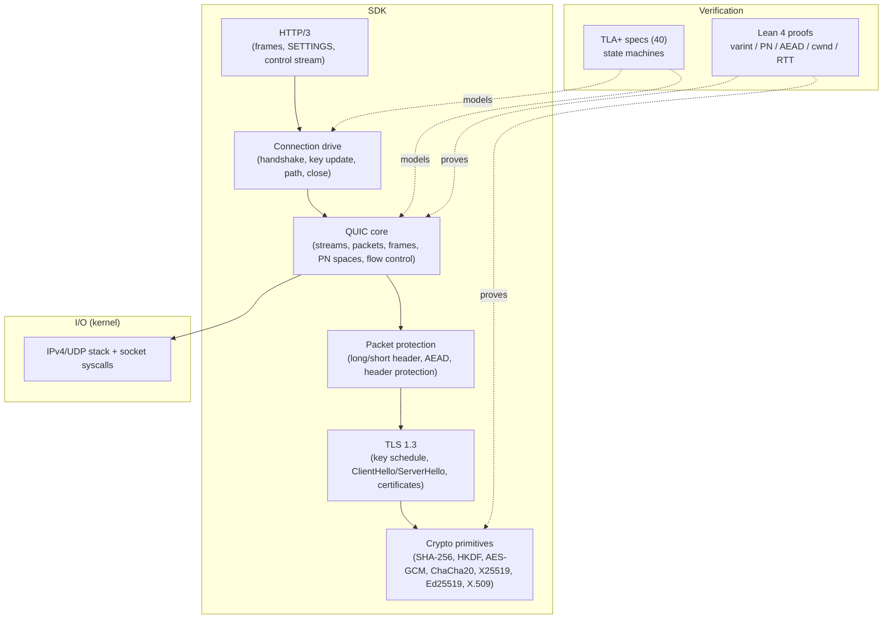
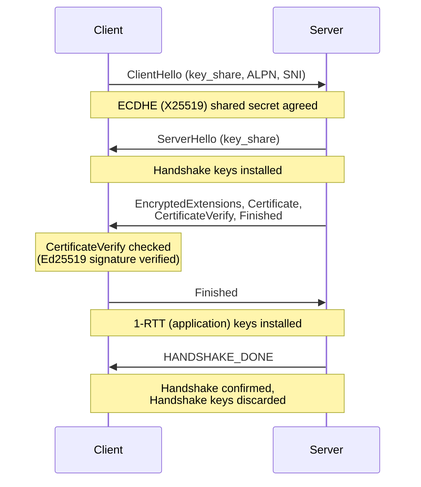

# quic_vibe

A libc-free QUIC SDK in C, built directly on x86_64 Linux syscalls. It
implements the QUIC transport (RFC 9000/9001/9002), TLS 1.3, and HTTP/3 wire
formats and state machines from scratch — its own `_start`, no libc, no
external dependencies. The cryptography, packet protection, key schedule, loss
recovery, congestion control, and an IPv4/UDP stack are all hand-written and
checked against the official RFC/FIPS test vectors.

## Highlights

- **libc-free**: compiles under `-ffreestanding -nostdlib -static`; its own
  `_start` and syscall wrappers, x86_64-linux only.
- **Every function stays within cyclomatic complexity 3** (enforced by a gate).
- **393 tests across 124 domains**, all assertion-based and hosted.
- **Official vectors only**: SHA-256 (FIPS 180-4), HMAC (RFC 4231), HKDF
  (RFC 5869), AES-GCM (SP 800-38D), ChaCha20-Poly1305 (RFC 8439), X25519
  (RFC 7748), Ed25519 (RFC 8032), ECDSA P-256 (RFC 6979), RSA. Initial keys
  match RFC 9001 A.1; the long-header Initial packet matches RFC 9001 A.2;
  ChaCha20 header protection matches RFC 9001 A.5.
- **Verified beyond tests**: the protocol state machines (connection drive, key
  update, Retry/Version-Negotiation reconnection, PN-space lifecycle, close /
  draining / idle) are model-checked before implementation — every reachable
  state explored, zero mutation survivors — and critical crypto/math (varint,
  packet-number decoding, AEAD, cwnd, RTT, the Ed25519 signing equation) is
  machine-proved. The model-checker counterexamples and proved predicates become
  1:1 golden tests.

## Architecture



Layers depend downward: HTTP/3 drives the connection, which drives the QUIC
core, which is protected by AEAD, keyed by TLS 1.3, built on the crypto
primitives. The TLA+ and Lean layers verify the design and the math; they are
not linked into the binary.

## TLS 1.3 handshake

The handshake runs to completion **in memory** (no sockets): the client and
server flights are real bytes, the ECDHE shared secret matches on both sides,
and the certificate signature is actually verified.



The top-level client API walks INITIAL → AUTH → CONFIRMED through this flow.
Coverage is end-to-end in the tests: real ECDHE agreement, a real server
flight with an Ed25519 `CertificateVerify`, 1-RTT key installation, handshake
confirmation, and Handshake-key discard.

## Quick start

```sh
just build    # compile every domain freestanding (proves libc independence)
just ninja    # fast incremental/parallel build
just test     # run the 393-test assertion suite
just check    # the CCN ≤ 3 gate plus the full test suite
```

`just build` auto-discovers every `src/**.c` file, so adding a domain needs no
edit to the build. A Nix dev shell (`nix develop`) provides clang, just, and
lizard.

## Documentation

- [docs/usage.md](docs/usage.md) — building, the `just` targets, the source
  layout, and how to use the library (including the kernel-free end-to-end
  flow and the explicit scope limits).
- [docs/development.md](docs/development.md) — the hard constraints, the
  test-first workflow, and how to add a domain.
- [examples/](examples/) — `quic_server.c` runs on a real UDP socket and has
  been driven through a round trip by a separate client process over loopback.

## Status and limits

What is proven here is the wire format and the state machines, not a deployed
endpoint. Stated honestly:

- **External interop confirmed with real `curl --http3` (quiche backend).** On a
  real external host, a real `curl --http3` linked against the quiche / BoringSSL
  backend completed the QUIC + TLS 1.3 handshake against the UDP example
  (`examples/quic_server`) and received `HTTP/3 200`. This was run on a VPS, not
  in this sandbox (the sandbox curl lacks HTTP/3), and covers the **quiche**
  backend only — curl's ngtcp2 backend and other clients need separate
  verification. See `examples/README.md`.
- **The steady-state event loop is wired to a real socket.** `connrunner` binds
  the deciding loop to a real UDP socket and the `connio` crypto layer, and
  drives real-byte loss retransmission, key update, Retry / Version-Negotiation
  reconnection, sent-packet metadata with in-flight accounting, and per-PN-space
  send/receive. What is unverified is the *external* round trip above, not the
  internal assembly.
- **`session`/`endpoint` do not talk to a real socket** (kernel-free by
  design); `connrunner` and the UDP example are the socket-facing path.
- **Intentionally out of scope**: full X.509 chain / path validation (the
  certificate is parsed and its Ed25519 signature verified, but trust-chain
  building is not done), 0-RTT replay defense, and CID-rotation privacy policy
  (an operational concern, not an SDK one). See [docs/usage.md](docs/usage.md)
  for the full scope.

## License

MIT — see [LICENSE](LICENSE).
