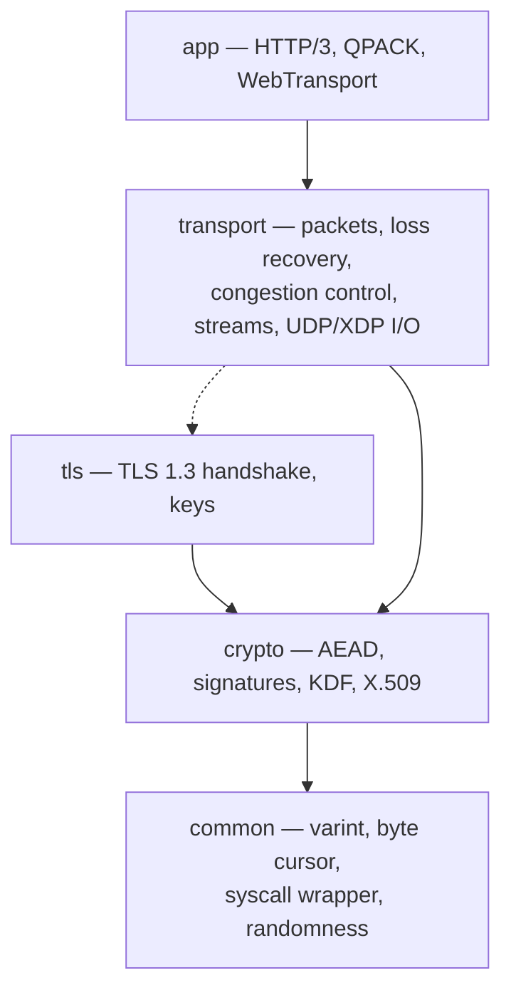

# wired

**An HTTP/3 + WebTransport server SDK in C that runs the entire protocol
stack in user space — with zero dependencies. No OpenSSL, no libevent, not
even libc.**

[](https://github.com/Hakkadaikon/wired/actions/workflows/ci.yml)
[](https://github.com/Hakkadaikon/wired/actions/workflows/fuzz.yml)
[](https://github.com/Hakkadaikon/wired/actions/workflows/docs.yml)
[](LICENSE)

Point a browser (or curl) at it and you get HTTP/3 over QUIC — the same
protocol stack behind most of today's web — served by a single static binary
that talks to the Linux kernel through raw syscalls and nothing else.

## Quick start

Three commands to a running HTTP/3 server:

```sh
just setup           # one-time: installs Nix if absent
just build           # format + compile + lint

cd examples/word_list
just run             # binds 0.0.0.0:4433
```

Test it from any machine that can reach UDP port 4433 (Docker keeps you from
needing an HTTP/3-capable curl locally):

```sh
docker run --rm ymuski/curl-http3 \
    curl --http3-only --insecure -v https://<host>:4433/
```

That's it. [Getting Started](docs/getting-started.md) walks through the same
thing step by step and takes you from here to a server of your own.

## What is this for?

- **Embedding an HTTP/3 / WebTransport server** in a project where you don't
  want a dependency chain — the whole SDK is one static library.
- **Learning how QUIC actually works.** Every layer, from the TLS handshake
  to congestion control to the bytes on the wire, is readable C in this one
  repository, each file annotated with the RFC section it implements.
- **Running interop and network experiments** — four interchangeable I/O
  drivers (from a simple `poll` loop up to kernel-bypass AF_XDP) behind one
  command-line switch.

You don't need to be a protocol expert to start: the quick start above and
the [examples](examples/) run as-is. The internals documentation is there
for when (and if) you want to go deeper.

> **First time hearing these terms?**
> **QUIC** is the encrypted UDP-based transport protocol that HTTP/3 runs
> on. **WebTransport** is the browser API for low-latency two-way
> streams and datagrams, built on HTTP/3. **AF_XDP** is a Linux fast path
> that delivers network packets to user space while bypassing most of the
> kernel stack. **libc-free** means the code uses no C standard library at
> all — it makes its own system calls.

## Why wired?

**Zero dependencies, zero libc.** Every source file compiles under
`-ffreestanding -nostdlib` — a compiler mode with no standard library — so
the build itself proves nothing external leaked in. The kernel is reached
through raw syscalls only, and the binary ships its own entry point.

**The full stack in user space.** QUIC
([RFC 9000](https://www.rfc-editor.org/rfc/rfc9000) /
[9001](https://www.rfc-editor.org/rfc/rfc9001) /
[9002](https://www.rfc-editor.org/rfc/rfc9002)),
TLS 1.3 ([RFC 8446](https://www.rfc-editor.org/rfc/rfc8446)),
HTTP/3 ([RFC 9114](https://www.rfc-editor.org/rfc/rfc9114)),
QPACK ([RFC 9204](https://www.rfc-editor.org/rfc/rfc9204)), and
WebTransport ([draft-ietf-webtrans-http3](https://datatracker.ietf.org/doc/draft-ietf-webtrans-http3/))
are all implemented here; the kernel only ever carries already-encrypted UDP
bytes.

**Four I/O drivers behind one CLI.** The same application callback runs
single-process (`poll`), multi-process (`fork` + `SO_REUSEPORT`),
multi-thread (raw `clone`/`futex`, no pthreads), or AF_XDP (packets polled
from a shared ring, zero per-packet receive syscalls) — selected by a
command-line flag, no code change.

**Its own verified cryptography.** AES-128-GCM, ChaCha20-Poly1305, X25519,
Ed25519, ECDSA P-256/P-384, RSA, SHA-2, HKDF — each implementation is
checked against the official RFC/FIPS test vectors.

**Auditable by construction.** Every function keeps cyclomatic complexity
≤ 3 (enforced in CI), clang-tidy CERT C rules run on every push, three
fuzzing harnesses run nightly, and a
[quic-interop-runner](https://github.com/quic-interop/quic-interop-runner)
server endpoint tests against real client implementations.

## How it fits together

Five layers, each in its own directory under `src/`, dependencies pointing
downward (the QUIC⇄TLS integration is the one deliberate exception):



The full picture — what each layer does and why the boundaries sit where
they do — is in [Architecture](docs/arch/overview.md).

## A complete server in one screen

The application side of a server is one callback plus one run call; the SDK
owns everything else — bind, handshake, packet protection, loss recovery,
HTTP/3, and the I/O driver selected at startup. Condensed from
[examples/word_list](examples/word_list/wired_server.c):

```c
#define WIRED_MAIN /* emits the libc shim + _start a -nostdlib binary needs */
#include "wired.h"
#include "app/http3/server/srvdriver/srvdriver.h"
#include "common/platform/exit/exit.h" /* wired_die */

static int app_on_request(
    void* ctx, const wired_h3reqdrive_req* req,
    quic_obuf* body_out, const char** content_type) {
  /* answer req (method/path/body views) by filling body_out */
  return 1;
}

int wired_main(int argc, char** argv) {
  wired_srvboot_id     id;
  wired_srvdriver_opt  opt;
  wired_srvrun_handler h   = {app_on_request, 0};
  wired_srvrun_obs     obs = {0};

  server_identity(&id); /* keys + self-signed cert seed, see examples/ */
  if (!wired_srvdriver_parse(argc, argv, &opt)) wired_die("bad flags\n");
  if (!wired_srvdriver_run(&id, h, obs, &opt)) wired_die("listen failed\n");
  return 0;
}
```

The same binary then picks its I/O driver from the command line: no flags
for a single process, `--workers N` for forked workers on one port,
`--cores a,b,c` for a thread fan-out, `--ifindex N --ip a.b.c.d` for AF_XDP.

## Examples

| Example | What it shows |
|---|---|
| [word_list](examples/word_list/) | HTTP/3 message log (POST/GET) or static-file server; all four I/O drivers; CA-certificate drop-in |
| [webtransport_chat](examples/webtransport_chat/) | Browser chat: live WebTransport sessions, DATAGRAM broadcast to every client, framework-free JS frontend |
| [webtransport_echo](examples/webtransport_echo/) | The WebTransport building blocks (session lifecycle, capsules, error mapping) driven in isolation |
| [webtransport_interop](examples/webtransport_interop/) | The [quic-interop-runner](https://github.com/quic-interop/quic-interop-runner) WebTransport server endpoint: file transfer over streams and DATAGRAMs against real client implementations |

## Documentation

Follow the [documentation index](docs/README.md), which orders every page by
what you're trying to do. The short version of the reading path:

1. [Getting Started](docs/getting-started.md) — build, run, and write your
   first server (start here).
2. [Architecture](docs/arch/overview.md) — how the stack works inside, with
   [per-layer detail](docs/arch/layers.md) and the
   [implemented specifications](docs/arch/rfcs.md).
3. [API stability](docs/api-stability.md) and the
   [API reference](https://hakkadaikon.github.io/wired/) — when you build
   against the SDK.
4. [Security](docs/security.md) and [Syscalls](docs/syscalls.md) — when you
   audit it.
5. [Development](docs/development.md) — when you change it.

## Supported platform

x86_64-linux only. The AF_XDP driver additionally needs root and kernel 5.9
or later (`BPF_LINK_CREATE` for XDP); on NICs without native XDP,
`--skb-mode` selects generic XDP —
note that some virtualized drivers (e.g. `virtio_net`) do not deliver AF_XDP
TX in generic mode, so prefer the plain UDP driver there.

## License

MIT — see [LICENSE](LICENSE).
