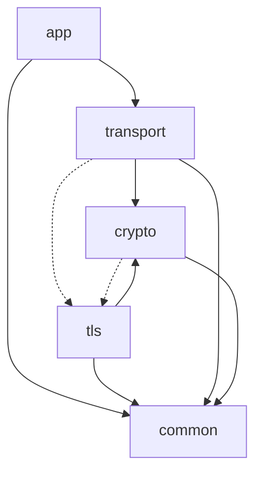

# The Layers

> **TL;DR** — five layers, bottom-up: **common** (byte primitives) →
> **crypto** (pure cryptographic functions) → **transport** (QUIC itself)
> and **tls** (keys and authentication) → **app** (HTTP/3). Each section
> below is self-contained; read only the layer you care about.

This chapter explains the five layers in terms of the problem each one solves.
For each layer, it describes in turn what it takes on, why it is an independent layer, what it relies on below and provides above, and where the key design points lie.

Dependencies between layers flow mostly in one direction, from top to bottom.
The only exception is the integration point of QUIC and TLS, where transport and crypto refer back up to tls.

## common: the bottom layer shared by every layer

common provides the foundation every other layer stands on.
QUIC's wire representation begins with the variable-length integer (varint).
Packet numbers, frame types, stream IDs, and the various lengths are all encoded as a varint that stretches from one to eight bytes depending on the size of the value (RFC 9000 §16).
If each layer held its own copy of this encoding, the slightest implementation difference would become an interoperability failure.
So the varint and the byte cursor (a scanner over a byte string that carries a read/write position) are unified in common, and every layer shares the same implementation.

It depends on nothing below.
The syscall wrapper, randomness (`getrandom`), and the error codes are placed here too.

The key design point is avoiding symbol collisions in the single-translation-unit build.
This project's tests compile all sources into a single translation unit.
As a result, if separate domains define a `static` helper with the same name, they collide.
Small functions such as byte copies or big-endian load/store are placed in common as `inline` and shared, rather than reinventing a `static` in each place.

Representative domains are varint, the byte cursor, syscall, and randomness.

## crypto: protect the packets, prove the peer

crypto takes on a single concern: cryptography.
Because QUIC encrypts every packet, including Initial, AEAD packet protection is needed in every phase of a connection.
Certificate verification needs signature verification, and the key schedule needs key derivation.

The reason this layer is independent is that the cryptographic functions are pure functions that know nothing of QUIC.
AES-GCM, ChaCha20-Poly1305, and X25519 are all deterministic mappings from input to output; they depend neither on QUIC's state nor on TLS messages.
Precisely because they have no such dependency, they can be verified on their own given official test vectors.
The design judgment of this layer is to separate out the concern that can be separated from QUIC's context.

It relies on common alone below.
Above, it provides AEAD for packet protection to transport, and HKDF for the key schedule to tls.

The key point is that the contact with tls lies in `HKDF-Expand-Label`.
The TLS 1.3 key schedule derives keys with labeled HKDF expansion, and QUIC's packet-protection keys are derived from the same function.
At this single point, the layer of pure cryptographic functions meshes with TLS key derivation.
It is because of this contact that part of crypto (key derivation and key sets) shares the type of tls's Initial keys.

Representative domains are AEAD (AES-GCM and ChaCha20-Poly1305), hashing (SHA-256 / SHA-512, HMAC), signatures (Ed25519, ECDSA P-256 / P-384, RSA-PSS), key derivation (HKDF), and X.509 parsing and verification.

## transport: lay reliable multiplexed streams over UDP

transport adds everything UDP lacks to provide reliable, multiplexed streams.
Here we answer the question of why it is built over UDP rather than TCP.
TCP exposes plaintext headers to the middleboxes on the path, and because those boxes act on the assumption of those values, the protocol's evolution has been held back.
QUIC encrypts the packets to shut out middlebox involvement, multiplexes several streams within one connection to avoid head-of-line blocking, and moves congestion control to the application side so that it is independent of kernel updates.
These benefits are only obtained by choosing UDP — which carries no reliability or ordering — as the foundation.

The price is that UDP does not retransmit lost packets.
So loss detection, congestion control, and ACK generation and processing are held by this layer itself.
It relies on crypto (packet protection) and common below, and refers back up to tls only at the integration point.
Above, it provides reliable per-stream byte streams to app.
io is the boundary with the kernel: it frames the IPv4 and UDP headers and operates the socket.

The key point is the two-level flow control.
QUIC limits the receive volume of the whole connection and that of each stream separately.
With only one of these, you cannot prevent a single stream from devouring the receive buffer of the whole connection.
Managing the two limits — per-connection and per-stream — at the same time is the central difficulty of this layer.
Congestion control offers three algorithms — NewReno (the default), CUBIC, and BBR, selected per run — and starts from an initial window of ten times the maximum datagram size (roughly 10 × 1200 bytes).

Representative domains are packet framing and protection, frame encoding, loss recovery and congestion control, streams and two-level flow control, the connection lifecycle, and UDP I/O.

## tls: make the keys, authenticate the peer

tls carries two roles: making the keys for encryption, and confirming that the peer is genuine.
The handshake creates a shared secret through ECDHE key exchange and derives QUIC's packet-protection keys from that secret.
At the same time, it verifies the server's certificate and its signature to authenticate the peer.
Because nothing can be encrypted without keys, and encryption is meaningless without authenticating the peer, these two roles cannot be split.

It relies on crypto (signature verification, key derivation, hashing) and common below.
Above, it provides the protection keys for each encryption level to transport.

The most important key point is the integration of QUIC and TLS.
TLS 1.3 originally runs over TCP and carries messages in its own record layer.
QUIC does not use that record layer; instead it carries the TLS handshake messages inside QUIC's CRYPTO frames.
So tls must assemble messages and hand them to transport's CRYPTO stream, and reassemble the received bytes back into handshake messages.
Because of this integration, the layer dependencies do not stay one-directional.

Another key point is the transport parameters.
QUIC's connection settings (the initial flow-control limits, the maximum idle time, the handling of connection IDs, and so on) are packed into a TLS extension and carried along with the handshake.
The TLS extension mechanism, meant for key exchange, doubles as the channel for conveying QUIC's setting values.

Representative domains are the construction and parsing of ClientHello and ServerHello, the key schedule, verification of the certificate and CertificateVerify, key update, and the transport-parameters extension.

## app: speak HTTP over QUIC

app speaks HTTP over the streams QUIC provides.
HTTP/3 splits requests and responses into frames and maps each onto a QUIC stream.

Here we answer why headers are compressed with QPACK rather than HTTP/2's HPACK.
HPACK depends on a single dynamic table whose compression state is shared across all streams, and it assumes that table is updated in order.
But QUIC's streams arrive independently of each other, and one stream's headers can arrive before another's.
Putting HPACK, which assumes ordering, directly on QUIC would bring back head-of-line blocking while waiting for the table to update.
QPACK separates the encoder instructions that update the table from the decoder instructions that announce their application onto dedicated streams, and specifies the table state each header block needs with a Required Insert Count.
The receiver only has to wait until the table reaches that state, and the wait is localized to just the header blocks whose table lagged.

It relies on transport (streams) and common below.
Above is the application itself.

Another domain is DATAGRAM.
The DATAGRAM frame (types 0x30 / 0x31) deliberately gives up QUIC's reliability and stream ordering to take low latency.
For uses that do not wait on retransmission, arriving quickly is worth more than arriving for certain.

Representative domains are HTTP/3 frames and the control stream, request and response assembly, QPACK encoding and decoding, and DATAGRAM.

---

**Next:** [Implemented Specifications](rfcs.md) — every spec these layers
implement. ([all docs](../README.md))
