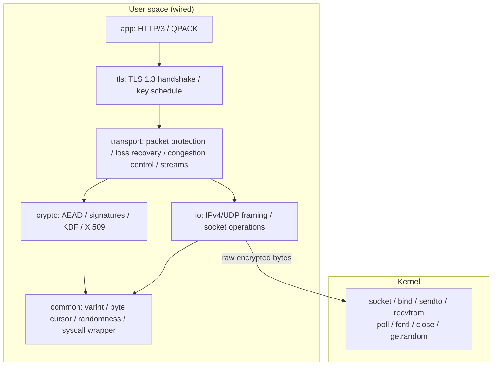
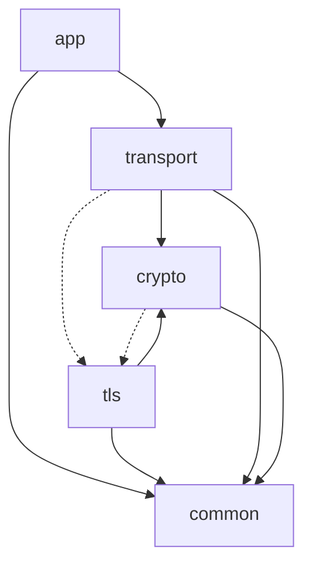
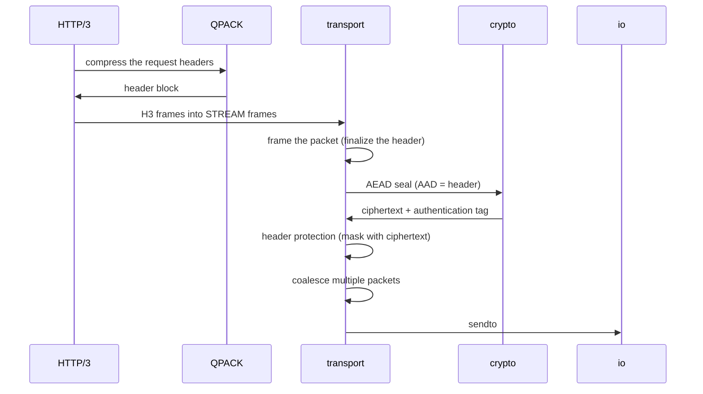
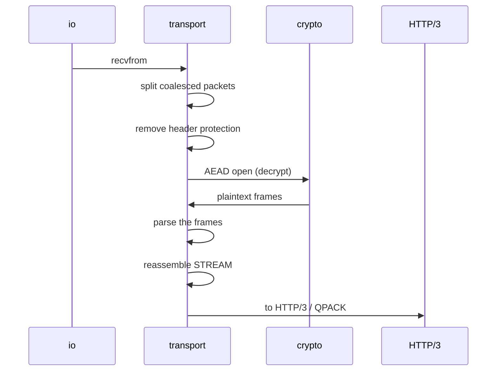
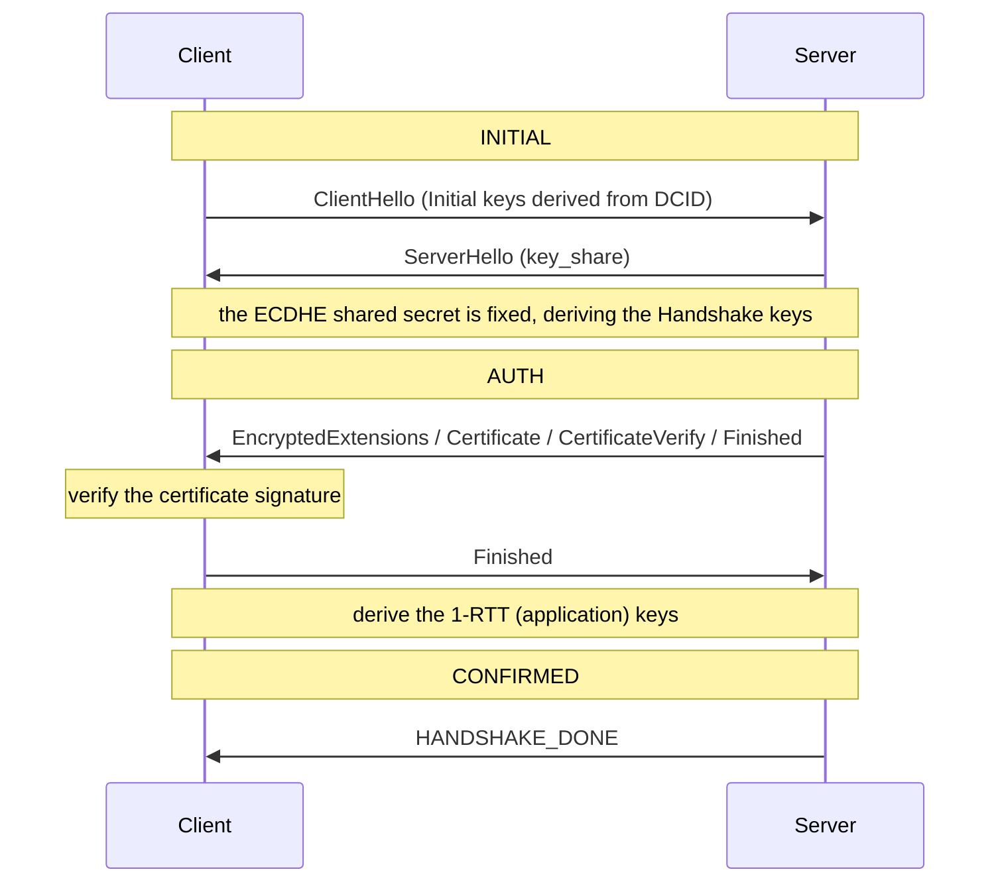

# Architecture and Data Flow

This chapter centers on how much wired does in user space and what it leaves to the kernel.
The goal is for someone reading QUIC for the first time to grasp why each layer sits in the order it does, and why it is placed where it is.

## The boundary between user space and the kernel

In TCP, the kernel owns retransmission, ordering, congestion control, and all of the connection state.
The application only touches the two ends of a byte stream, so a better congestion controller or a new loss-recovery scheme cannot reach it until the kernel itself is updated.
QUIC removed that constraint by standing on top of UDP.
Because UDP only carries datagrams — no reliability, no ordering, no encryption — all of those concerns can be pulled into the application.
wired pushes this to the limit and shows the kernel nothing of QUIC's semantics.

What remains in the kernel is only the carriage of already-encrypted bytes.
The place that actually issues a syscall is concentrated in a single inline-assembly function called `syscall6`, and every other piece of code reaches the kernel only through that function.
The wire loop itself needs only a small set: raw UDP send and receive (`sendto` / `recvfrom`), preparing and waiting on a socket (`socket` / `bind` / `poll` / `fcntl` / `close`), and randomness (`getrandom`).
Around it, the SDK reaches the kernel for a few more concerns — AF_XDP setup (`mmap` / `getsockopt` / `bpf`), worker threads (`clone` / `futex`), signal handling (`rt_sigaction`), file I/O (`openat` / `read` / `write`), and the clock (`clock_gettime`).
The complete list, with why each syscall is needed and where it is issued, is in [docs/syscalls.md](../syscalls.md).
What the kernel carries is an encrypted byte string; the kernel never interprets which QUIC packet or which frame those bytes are.

Packet framing, encryption and header protection, the TLS handshake, loss recovery, congestion control, stream multiplexing, HTTP/3 and QPACK, X.509 verification, and every cryptographic function are all held in user space.
The test path that merely round-trips bytes through memory (the memlink described later) never issues a single syscall at all.

A libc-free design helps with both portability and verifiability.
Because it depends on no particular implementation of a standard library, the very fact that it compiles under `-ffreestanding -nostdlib` proves the absence of external dependencies.
Since the dependency is closed to a single syscall-wrapper function, where the code touches the kernel can be seen at a glance, and every other line can be treated as a pure transformation.

## The five layers

The user-space code is divided into five layers.
The higher a layer sits, the more abstract it is; the lower it sits, the closer it is to the foundation.

| Layer | Directory | Responsibility |
|----|------------|------|
| app | `src/app/` | HTTP/3 frames and state machine, header compression with QPACK. |
| tls | `src/tls/` | TLS 1.3 handshake, key schedule, transport parameters. |
| transport | `src/transport/` | Packet framing and protection, loss recovery, congestion control, streams, UDP I/O. |
| crypto | `src/crypto/` | AEAD, hashing, signatures, key derivation, X.509 parsing and verification. |
| common | `src/common/` | varint, byte cursor, syscall wrapper, randomness, error codes. |

Dependencies flow mostly in one direction, from top to bottom.
At the integration point of QUIC and TLS, however, that one-way flow breaks.

The dotted lines mark the exception where the layer boundary and the key boundary do not coincide.
The QUIC handshake carries TLS messages inside CRYPTO frames, transported in QUIC packets.
So transport refers to tls in order to drive the TLS handshake, and crypto's key derivation shares the type of the initial Initial keys with tls.
The keys are made by tls, but the bytes those keys protect are carried by transport, and the two need each other.
Trying to force the dependencies fully downward would split this integration unnaturally.
Here the mutual reference is left in place as a fact of the design.

common is the complete bottom layer that depends on no other layer.
All layers share the same varint encoding and byte cursor, and to avoid symbol collisions in the single-translation-unit build described later, the shared small functions are placed here as `inline`.

## Data flow

We follow three representative flows.
In each, the focus is on why the order has to be the way it is.

### Sending: from GET to the wire

This shows the flow from an application issuing a GET to the encrypted bytes being handed to the socket.

The order cannot be rearranged because the two stages of protection depend on each other's output.
AEAD encrypts with the packet header as additional authenticated data (AAD), so it cannot seal until the header is finalized.
Header protection samples part of the ciphertext that AEAD produced to build a mask, then covers header fields such as the packet number.
Therefore the order — finalize the header → AEAD → header protection — cannot be swapped.

### Receiving: from the wire to the application

Receiving traces the reverse of sending.

Here too there is a reason to peel off header protection first.
Header protection covers the packet number, so without removing it the packet number cannot be read.
The packet number is the material for assembling the AEAD nonce, and without a fixed nonce decryption is impossible.
In other words, the dependency — remove header protection → fix the packet number → AEAD decrypt — determines the order on the receiving side.

### The handshake: establishing the connection while making the keys

The handshake is the process that produces the very keys used for encryption.

The first packet must be encrypted even though the key exchange has not yet happened.
QUIC solves this by deriving the Initial keys through a fixed procedure from the destination connection ID (DCID) of the peer.
The Initial keys are not secret — anyone on the path can derive them by the same procedure — but they do serve to structure the first packet and detect tampering.
Once both sides' key_share values are present in ServerHello, the ECDHE shared secret is fixed, and only here can the secret Handshake keys be derived.
Verifying the server's certificate and signature authenticates the peer, and exchanging Finished derives the 1-RTT keys for application data.
Finally, receiving HANDSHAKE_DONE moves the connection to CONFIRMED and the Handshake keys are discarded.
This flow from INITIAL through AUTH to CONFIRMED can be read as the process by which the handshake itself dissolves the constraint that nothing can be encrypted without a key — by producing the keys as it goes.
