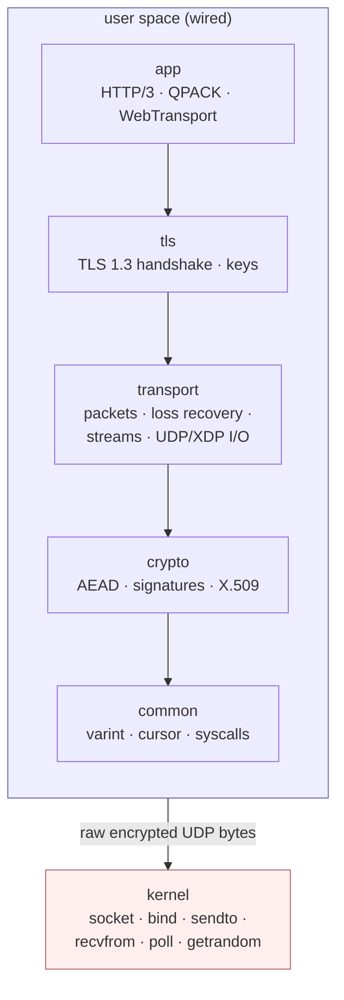
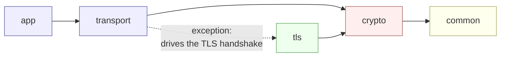
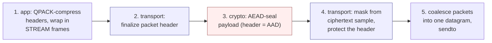
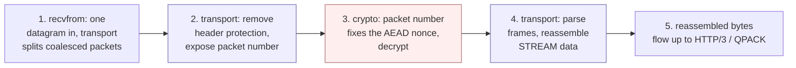
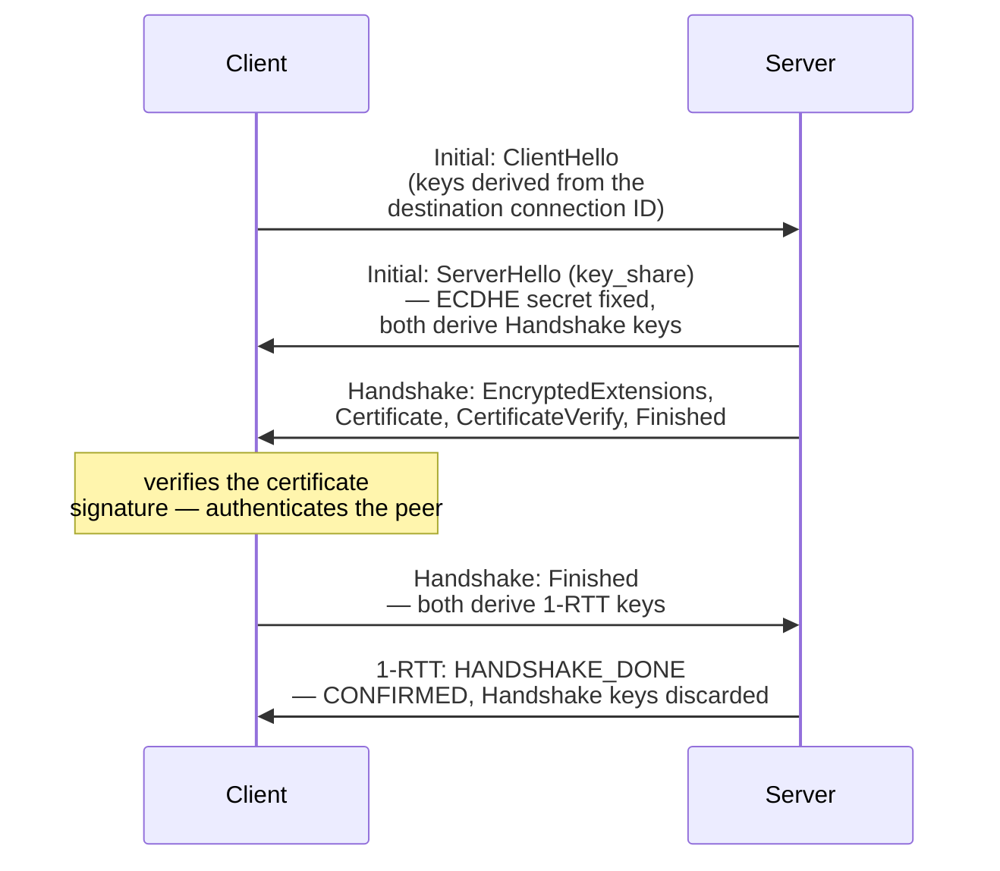
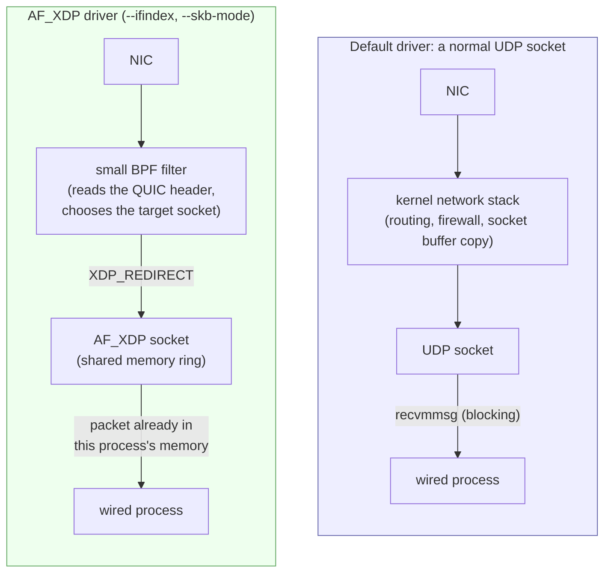
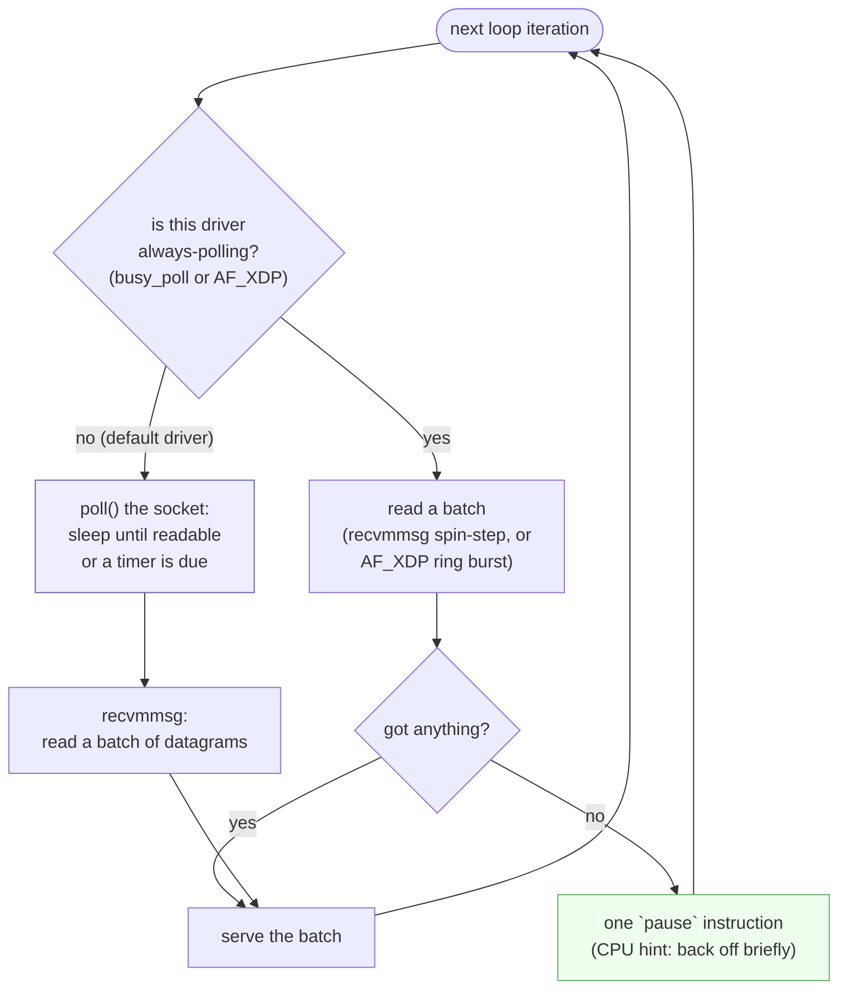

[Docs](../README.md) › Architecture › Overview

# Architecture and Data Flow

> **TL;DR** — the kernel only moves already-encrypted UDP bytes. Everything
> QUIC-related — packets, keys, retransmission, HTTP/3 — happens in five
> user-space layers inside this SDK.

## The boundary between user space and the kernel

In TCP, the kernel owns retransmission, ordering, congestion control, and all of the connection state.
QUIC removed that constraint by standing on top of UDP: because UDP only carries datagrams — no reliability, no ordering, no encryption — all of those concerns can be pulled into the application.
wired pushes this to the limit and shows the kernel nothing of QUIC's semantics.

```mermaid
graph TB
    subgraph us["user space (wired)"]
        direction TB
        app["app<br/>HTTP/3 · QPACK · WebTransport"]
        tls["tls<br/>TLS 1.3 handshake · keys"]
        transport["transport<br/>packets · loss recovery ·<br/>streams · UDP/XDP I/O"]
        crypto["crypto<br/>AEAD · signatures · X.509"]
        common["common<br/>varint · cursor · syscalls"]
        app --> tls --> transport --> crypto --> common
    end
    kernel["kernel<br/>socket · bind · sendto ·<br/>recvfrom · poll · getrandom"]
    us -- "raw encrypted UDP bytes" --> kernel

    style us fill:#eef,stroke:#66a,stroke-width:1px
    style kernel fill:#fee,stroke:#a66,stroke-width:1px
```

The place that actually issues a syscall is concentrated in a single inline-assembly function called `syscall6`; every other piece of C code reaches the kernel only through that function, the sole exceptions being three unavoidable asm trampolines (thread exit, signal return, and the `_start` entry stub).
The wire loop needs only a small set: UDP send/receive, socket setup and `poll`, and `getrandom`.
The complete list, with why each syscall is needed and where it is issued, is in [Syscalls](../syscalls.md).

Everything else — packet framing, encryption and header protection, the TLS handshake, loss recovery, congestion control, stream multiplexing, HTTP/3 and QPACK, X.509 verification, every cryptographic function — is held in user space.
The test path that merely round-trips bytes through memory (memlink, an in-memory loopback transport under `src/transport/io/socket/net/`) never issues a single syscall at all.

This is what makes the libc-free design verifiable: compiling under `-ffreestanding -nostdlib` proves the absence of external dependencies, and with the kernel contact closed to one wrapper function, every other line can be treated as a pure transformation.

## The five layers

| Layer | Directory | Responsibility |
|----|------------|------|
| app | `src/app/` | HTTP/3 frames and state machine, header compression with QPACK, WebTransport sessions, Media over QUIC Transport (MoQT). |
| tls | `src/tls/` | TLS 1.3 handshake, key schedule, transport parameters. |
| transport | `src/transport/` | Packet framing and protection, loss recovery, congestion control, streams, UDP I/O. |
| crypto | `src/crypto/` | AEAD, hashing, signatures, key derivation, X.509 parsing and verification. |
| common | `src/common/` | varint, byte cursor, syscall wrapper, randomness, error codes. |

Dependencies point downward, with one deliberate exception at the QUIC⇄TLS
integration point (every layer also uses common, omitted for clarity):

```mermaid
graph LR
    app --> transport --> crypto --> common
    transport -. "exception:<br/>drives the TLS handshake" .-> tls --> crypto

    style app fill:#eef,stroke:#66a
    style transport fill:#eef,stroke:#66a
    style tls fill:#efe,stroke:#6a6
    style crypto fill:#fee,stroke:#a66
    style common fill:#ffe,stroke:#aa6
```

The exception exists because the QUIC handshake carries TLS messages inside CRYPTO frames, transported in QUIC packets: transport must drive the TLS handshake, and crypto's key derivation shares the Initial-key type with tls.
The keys are made by tls, but the bytes those keys protect are carried by transport — the two need each other, and forcing the dependency fully downward would split that integration unnaturally.

common is the complete bottom layer that depends on nothing.
All layers share its varint encoding and byte cursor, and shared small helpers live here as `inline` to avoid symbol collisions in the single-translation-unit test build.

## Data flow

Three representative flows. In each, the order is forced by a dependency, noted after the steps.

### Sending: from GET to the wire

```mermaid
flowchart LR
    a1["1. app: QPACK-compress\nheaders, wrap in\nSTREAM frames"] --> a2["2. transport:\nfinalize packet header"]
    a2 --> a3["3. crypto: AEAD-seal\npayload (header = AAD)"]
    a3 --> a4["4. transport: mask from\nciphertext sample,\nprotect the header"]
    a4 --> a5["5. coalesce packets\ninto one datagram,\nsendto"]

    style a2 fill:#eef,stroke:#66a
    style a4 fill:#eef,stroke:#66a
    style a3 fill:#fee,stroke:#a66
```

The order cannot be rearranged: AEAD needs the finalized header (step 2
before 3), and header protection needs AEAD's ciphertext (step 3 before 4).

### Receiving: from the wire to the application

```mermaid
flowchart LR
    b1["1. recvfrom: one\ndatagram in, transport\nsplits coalesced packets"] --> b2["2. transport: remove\nheader protection,\nexpose packet number"]
    b2 --> b3["3. crypto: packet number\nfixes the AEAD nonce,\ndecrypt"]
    b3 --> b4["4. transport: parse\nframes, reassemble\nSTREAM data"]
    b4 --> b5["5. reassembled bytes\nflow up to HTTP/3 / QPACK"]

    style b2 fill:#eef,stroke:#66a
    style b4 fill:#eef,stroke:#66a
    style b3 fill:#fee,stroke:#a66
```

Again the order is forced: the packet number is under header protection
(step 2 before 3), and the nonce needs the packet number (step 3 before 4).

### The handshake: establishing the connection while making the keys

```mermaid
sequenceDiagram
    participant C as Client
    participant S as Server
    C->>S: Initial: ClientHello<br/>(keys derived from the<br/>destination connection ID)
    S->>C: Initial: ServerHello (key_share)<br/>— ECDHE secret fixed,<br/>both derive Handshake keys
    S->>C: Handshake: EncryptedExtensions,<br/>Certificate, CertificateVerify, Finished
    Note over C: verifies the certificate<br/>signature — authenticates the peer
    C->>S: Handshake: Finished<br/>— both derive 1-RTT keys
    S->>C: 1-RTT: HANDSHAKE_DONE<br/>— CONFIRMED, Handshake keys discarded
```

The handshake dissolves its own bootstrap problem — nothing can be
encrypted without a key — by producing the keys as it goes.

## How a packet reaches the application: I/O drivers

Everything above this point is the same regardless of how a datagram
physically arrives. But *how* it arrives — which kernel API moves the
bytes, and whether the process waits idle or spins checking — is a real
design choice with a real speed/CPU trade-off, and wired supports more than
one. This section is about `src/transport/io/` and
`src/app/http3/server/srvrun/`'s receive loop, one level below the "UDP/XDP
I/O" box in the layer diagram above.

### Two ways to get a datagram out of the kernel

```mermaid
graph TB
    subgraph defaultdrv["Default driver: a normal UDP socket"]
        direction TB
        nic1["NIC"] --> stack["kernel network stack<br/>(routing, firewall, socket buffer copy)"]
        stack --> sock["UDP socket"]
        sock -- "recvmmsg (blocking)" --> app1["wired process"]
    end

    subgraph xdp["AF_XDP driver (--ifindex, --skb-mode)"]
        direction TB
        nic2["NIC"] --> bpf["small BPF filter<br/>(reads the QUIC header,<br/>chooses the target socket)"]
        bpf -- "XDP_REDIRECT" --> xsk["AF_XDP socket<br/>(shared memory ring)"]
        xsk -- "packet already in<br/>this process's memory" --> app2["wired process"]
    end

    style defaultdrv fill:#eef,stroke:#66a
    style xdp fill:#efe,stroke:#6a6
```

**Default driver** (no extra flags): a plain `socket()` + `bind()` UDP
socket, the same API every server uses. The kernel's normal network stack —
routing, firewall rules, a copy into the socket's receive buffer — runs for
every packet before wired ever sees it. This is what quic-go, quiche,
ngtcp2, and picoquic all use too, since none of them have an AF_XDP driver.

**AF_XDP driver** (`--ifindex <n> --ip <addr>`, optionally `--skb-mode` for
the software-emulated "generic" mode used when the NIC driver has no native
XDP support): a small BPF program is attached directly to the network
interface, before the kernel's normal stack runs. It reads just enough of
the QUIC header to route the packet, then hands it to an `AF_XDP` socket —
a ring buffer shared between the kernel and this process's memory, so the
packet data does not need a second copy into a socket buffer. Fewer copies
and less stack traversal per packet is why this path measured faster in
practice (see [`comparison.md`](../comparison.md#speed-af_xdp-driver-over-a-real-nic-informational)).

Both drivers still run in **one process**; AF_XDP changes the *path* a
packet takes to reach that process, not how many processes are involved.
(A separate, unrelated knob — `--workers N` — forks *N* processes that
share one port via `SO_REUSEPORT`; that is a different axis entirely and
composes independently of which I/O driver each worker uses.)

### Waiting for the next packet: block, or spin?

The receive loop (`srvrun_step` in `srvrun.c`) has to decide, every
iteration, whether to sleep until a packet arrives or to keep checking in a
tight loop:

```mermaid
graph TB
    start(["next loop iteration"]) --> polling{"is this driver\nalways-polling?\n(busy_poll or AF_XDP)"}
    polling -- "no (default driver)" --> block["poll() the socket:\nsleep until readable\nor a timer is due"]
    block --> recv1["recvmmsg:\nread a batch of datagrams"]
    polling -- "yes" --> recv2["read a batch\n(recvmmsg spin-step, or\nAF_XDP ring burst)"]
    recv2 --> empty{"got anything?"}
    empty -- "no" --> pauseinsn["one `pause` instruction\n(CPU hint: back off briefly)"]
    pauseinsn --> start
    empty -- "yes" --> serve["serve the batch"]
    recv1 --> serve
    serve --> start

    style block fill:#eef,stroke:#66a
    style pauseinsn fill:#efe,stroke:#6a6
```

The **default driver blocks**: `poll()` puts the process to sleep and the
kernel wakes it back up when a datagram (or a retransmission timer) is
due. CPU usage stays near zero while idle, at the cost of a wake-up latency
on each new packet. (One further wrinkle the diagram simplifies away: with
no connection active yet, the loop skips even the `poll()` timeout and lets
`recvmmsg` itself block indefinitely — there's nothing else it could be
waiting for.)

**`--busy-poll` and AF_XDP never block.** They read a batch, and if it's
empty, execute a single `pause` instruction (an x86 hint that lowers power
use during a spin without actually sleeping) and immediately loop back to
check again. This trades CPU for latency: idle time on a purely
polling-driven core reads as ~100% CPU used the whole time, even with no
traffic, because the process is continuously checking rather than sleeping.
AF_XDP is *always* in this mode — there is no blocking variant of it in
this SDK, since the AF_XDP ring has no file-descriptor-readable event to
`poll()` on in the way a normal socket does.

### Choosing a driver: what to reach for

| Driver | Flags | Processes | Waits by | When it fits |
|---|---|---|---|---|
| Default UDP | *(none)* | 1 | blocking `poll` | The safe default: low idle CPU, no special privileges, works everywhere. |
| Busy-poll UDP | `--busy-poll` | 1 | spinning | Lower per-packet latency than the default, still a normal socket, no root/capabilities needed. |
| Multi-worker | `--workers N` | N (forked) | driver-dependent per worker | More cores for throughput, but see the known limitation in `src/app/http3/server/srvworkers/srvworkers.h`: `SO_REUSEPORT`'s kernel-side routing gives no guarantee a connection's packets keep landing on the same worker, so handshakes can intermittently fail. |
| AF_XDP | `--ifindex <n> --ip <addr> [--skb-mode]` | 1 (or 1 process with N worker *threads* via `--cores`, distinct from `--workers`' processes) | spinning | Highest throughput measured so far ([data](../comparison.md#speed-af_xdp-driver-over-a-real-nic-informational)), at the cost of needing `CAP_BPF`/`CAP_NET_ADMIN`, generic mode without a NIC driver's native support, and less production-hardening than the default path. |

---

**Next:** [The Layers](layers.md) — each layer in depth.
([all docs](../README.md))
