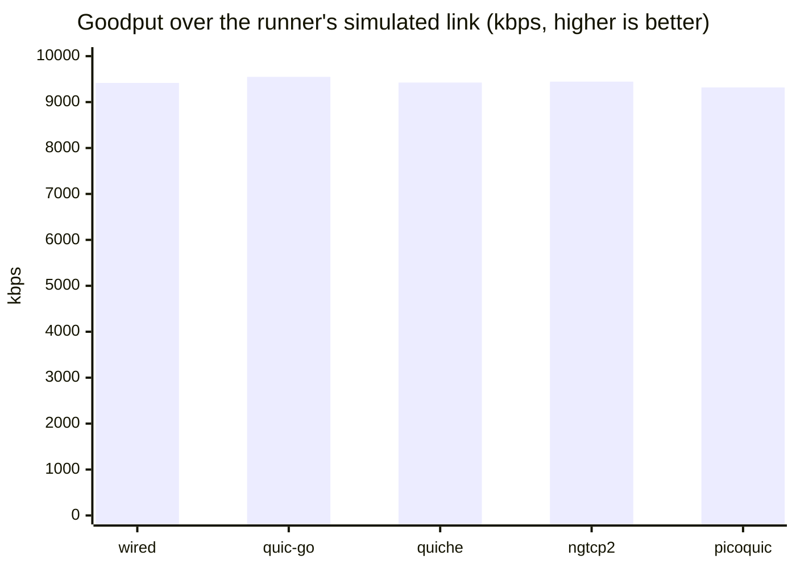
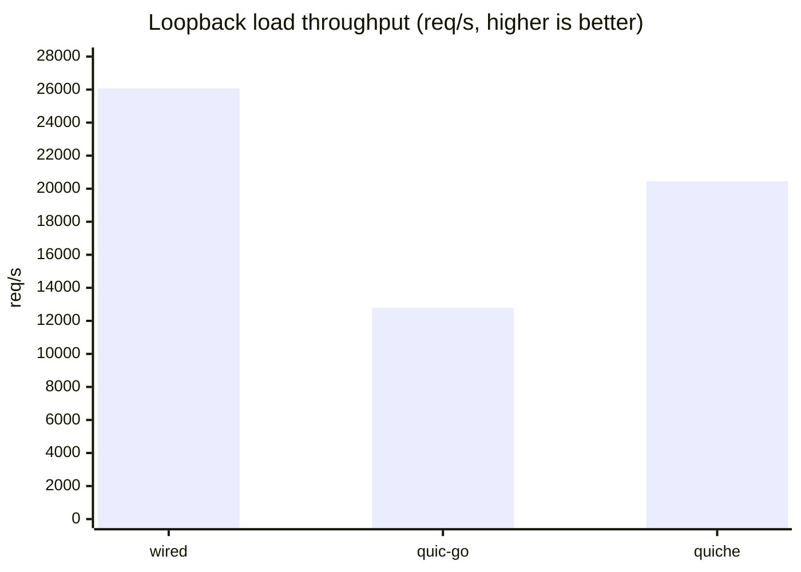
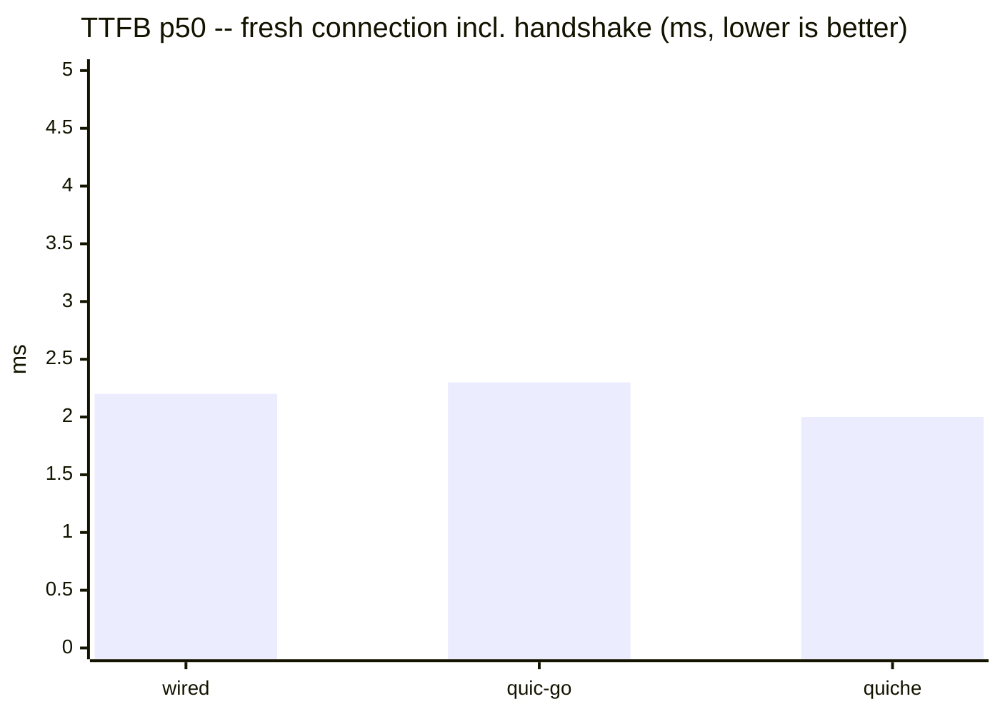
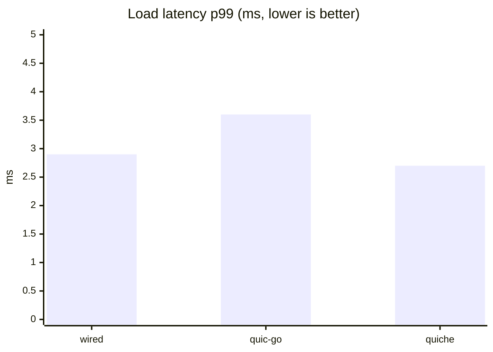

[Docs](README.md) › Comparison

# Implementation Comparison

How wired compares to other HTTP/3 / WebTransport / MOQT implementations, in
features (documented against each project's own sources) and in speed
(measured under pinned, equal conditions).

> **Scope disclaimer.** Every number below is a measurement from one specific
> day (2026-08-16 local; the runner's log directories carry UTC stamps of
> 2026-08-15T16:xx onward) on one specific machine (a 4-vCPU KVM VM, see the
> [environment appendix](#environment)), against pinned versions. wired is
> pinned at one commit (`9d21db9`) for every lane. It is not a claim of
> general superiority or inferiority of any implementation. Bad numbers are
> published along with good ones.

Legend: `✅` supported · `Partial` supported with a stated limitation ·
`—` not supported / not measured, with the reason in the cell or footnote.

## Feature matrix

Sources: each cell cites the project's own README/source at the pinned
version — wired at commit `9d21db9`, quic-go `v0.61.0`, quiche `0.29.3`,
ngtcp2 (interop image, untagged) [^ng-img], picoquic (interop image,
untagged) [^pq-img].

| Axis | wired | quic-go | quiche | ngtcp2 (+nghttp3) | picoquic |
|---|---|---|---|---|---|
| Language | C, freestanding [^w-libc] | Go (pure Go) [^qg-readme] | Rust (+ BoringSSL C/C++) [^qc-readme] | C11 (examples C++23) [^ng-readme] | C [^pq-readme] |
| TLS stack | Own built-in TLS 1.3 (no external TLS library) [^w-tls] | Go standard library crypto/TLS [^qg-readme] | BoringSSL [^qc-readme] | Pluggable: GnuTLS, BoringSSL/aws-lc, Picotls, wolfSSL, LibreSSL, OpenSSL ≥ 3.5 [^ng-readme] | picotls (optional MbedTLS) [^pq-readme] |
| libc dependency | None — every `src/**/*.c` compiles `-ffreestanding -nostdlib`; direct syscalls [^w-libc] | None (no cgo), but requires the Go runtime [^qg-nocgo] | Yes (Rust std + linked BoringSSL) [^qc-readme] | Yes (hosted C11) [^ng-readme] | Yes (hosted C) [^pq-readme] |
| Server binary size (see definition [^binsize]) | 369,312 B (static, no libc) [^binsize] | 7,310,976 B (static Go binary incl. runtime) [^binsize] | 6,126,288 B (BoringSSL static, glibc dynamic) [^binsize] | — (no native build in this comparison [^binsize]) | — (no native build in this comparison [^binsize]) |
| HTTP/3 (RFC 9114) | ✅ server side [^w-h3] | ✅ [^qg-readme] | ✅ (`h3` module) [^qc-h3] | ✅ via nghttp3 [^ng-h3] | ✅ minimal ("h3zero", demo grade) [^pq-readme] |
| QPACK dynamic table (RFC 9204) | Partial — decoder has a live dynamic table; server advertises capacity 0 and its encoder is static-only [^w-qpack] | — (qpack v0.6.0 is static-table only) [^qg-qpack] | — ("TODO: implement dynamic table") [^qc-qpack] | ✅ (nghttp3 "supports dynamic table") [^ng-qpack] | — (static-only, zero-length dynamic dictionary) [^pq-qpack] |
| WebTransport (RFC 9220 + draft-webtrans-http3) | ✅ server side [^w-wt] | Partial — separate companion module webtransport-go [^qg-readme] | Partial — Extended CONNECT only, no WT session layer [^qc-wt] | Partial — nghttp3 ships RFC 9220/9297 prerequisites only [^ng-wt] | ✅ (`picohttp/webtransport.c`) [^pq-wt] |
| QUIC DATAGRAM (RFC 9221) | ✅ [^w-dgram] | ✅ [^qg-readme] | ✅ [^qc-dgram] | ✅ [^ng-readme] | ✅ [^pq-readme] |
| 0-RTT | ✅ interop-proven (`zerortt` PASS vs quic-go) [^w-interop] | ✅ [^qg-0rtt] | ✅ (`enable_early_data`) [^qc-0rtt] | ✅ [^ng-0rtt] | ✅ [^pq-0rtt] |
| Key Update (RFC 9001 §6) | ✅ interop-proven both directions [^w-interop] | ✅ initiates + responds [^qg-ku] | Partial — responds to peer-initiated only, no local-initiate API [^qc-ku] | ✅ (`ngtcp2_conn_initiate_key_update`) [^ng-ku] | ✅ (`picoquic_start_key_rotation`) [^pq-ku] |
| ECN | Partial — implemented + unit-tested; no third-party E2E verdict (peer limitation) [^w-interop] | ✅ on by default [^qg-ecn] | — (sending ECN not supported) [^qc-ecn] | ✅ (validation state machine) [^ng-ecn] | ✅ (ACK_ECN + counters) [^pq-ecn] |
| Connection migration (server-side path validation) | Partial — implemented; E2E unverdictable (tooling/peer limitations) [^w-interop] | ✅ [^qg-mig] | ✅ [^qc-mig] | ✅ [^ng-mig] | ✅ [^pq-mig] |
| QUIC v2 (RFC 9369) | Partial — implemented + unit-proven; no third-party E2E (peer limitation) [^w-interop] | ✅ [^qg-readme] | — (v1 only) [^qc-v2] | ✅ [^ng-readme] | ✅ [^pq-v2] |
| MOQT | ✅ draft-ietf-moq-transport-19, server/relay role over WebTransport; the `moqt-19` WT subprotocol name is an application-layer convention used by the example, not a value the SDK core negotiates [^w-moqt] | — [^qg-nomoqt] | — [^qc-nomoqt] | — [^ng-nomoqt] | — (only a `moqt-16` header string in a test) [^pq-nomoqt] |

For MOQT specifically, the third-party landscape (surveyed 2026-08-04):
imquic supports draft versions 16–19; moxygen 14/15/16/18; libquicr and
moqtail 16; aiomoqt 14/16/18(beta); moq-lite is a diverged fork, not
draft-ietf-moq-transport [^moqt-survey].

## Speed: standardized simulated link (goodput)

Method: [quic-interop-runner](https://github.com/quic-interop/quic-interop-runner)
`goodput` measurement (10 MB transfer over the runner's simulated link,
5 repetitions), runner commit `1d6f655`. The client is pinned to the same
quic-go interop image for every server (`martenseemann/quic-go-interop:latest`),
so every server faces identical client behavior and an identical link. All
endpoints run as Docker containers — one execution form across the row. All
five rows were measured back-to-back on the same day, on an otherwise idle
machine.

| Server | Goodput (5 runs) | Server image |
|---|---|---|
| wired | 9417 (± 43) kbps | `wired-interop` built from commit `9d21db9` |
| quic-go | 9549 (± 15) kbps | `martenseemann/quic-go-interop:latest` |
| quiche | 9425 (± 24) kbps | `cloudflare/quiche-qns:latest` |
| ngtcp2 | 9446 (± 56) kbps | `ghcr.io/ngtcp2/ngtcp2-interop:latest` |
| picoquic | 9320 (± 19) kbps | `privateoctopus/picoquic:latest` |



wired (9417) sits between quiche (9425) and ngtcp2 (9446) on one side and
picoquic (9320) on the other, with the gaps to both neighbors inside or
near the run-to-run spread; quic-go (9549) leads the field on this link.
wired's defaults for this lane: Cubic congestion control, DPLPMTUD raising
the datagram size to the link's full 1440 bytes, a token-bucket pacer
(see the [defaults table](#server-defaults-loopback-lane)).

## Speed: loopback per-request overhead

Method: one pinned load client (a small quic-go v0.61.0 HTTP/3 client, see
the [appendix](#bench-client-and-server-source)) against each server on
`127.0.0.1`, plain loopback (netem unavailable in this environment). All
servers run as native binaries pinned to CPU core 3; the client uses cores
0–1. Same ECDSA P-256 certificate, same 1 KiB file, each server at its own
defaults (recorded [below](#server-defaults-loopback-lane)). Per round: 100
fresh-connection requests ("TTFB" [^ttfb-def]) plus 10,000 requests over 20
concurrent streams on a warmed connection ("load"). 5 rounds per server. A
request unanswered for 10 s counts as a failure and the worker moves on.

| Server (native) | TTFB p50 (ms) | load req/s | load p50 (ms) | load p99 (ms) | failures |
|---|---|---|---|---|---|
| wired `9d21db9` | 2.2 ± 0.1 | 26,079 ± 1,075 | 0.64 ± 0.02 | 2.9 ± 0.3 | 0 / 50,500 |
| quic-go v0.61.0 | 2.3 ± 0.1 | 12,788 ± 502 | 1.35 ± 0.04 | 3.6 ± 0.3 | 0 / 50,500 |
| quiche 0.29.3 (`55886df`) | 2.0 ± 0.1 | 20,453 ± 1,622 | 0.90 ± 0.06 | 2.7 ± 0.4 | 0 / 50,500 |
| ngtcp2 | — (no native build attempted: multi-stage autotools chain; measured in the goodput lane only) | — | — | — | — |
| picoquic | — (no native build attempted: multi-stage cmake chain incl. picotls; measured in the goodput lane only) | — | — | — | — |







(Bars plot the table means.) Client CPU ran past comfortable headroom for
the fastest rows — wired's client-side CPU peaked at 132% of the 200%
two-core budget and quiche's at 118%, against quic-go's 68–80% — so read
the ratios between the fastest servers as indicative, not exact (those rows
are at least partly client-bound). The lane showed no stalls or failures
across 50,500 requests on any server.

## Interop test cases (current run)

Re-run against commit `9d21db9` alongside the benchmarks above (client:
quic-go, runner commit `1d6f655`):

| Test case | Result | Note |
|---|---|---|
| `handshake` | ✅ | |
| `http3` | ✅ | |
| `multiplexing` | ✅ | |
| `transfer` | ✅ | |
| `blackhole` | ✅ | |

Full per-testcase status (broader set, including WebTransport) is
maintained separately in [Interop Results](interop.md); the five rows above
are the ones this comparison's benchmarks depend on and were independently
re-verified for this document.

## WebTransport and MOQT

**WebTransport (speed):** not measured. The interop runner's WebTransport
suite contains functional test cases only (fixed-size transfers, no
goodput-style measurement), and a custom benchmark would require writing a
per-implementation application layer, which breaks the equal-conditions
premise. Functional WebTransport interop results against webtransport-go are
in [Interop Results](interop.md).

**MOQT (interop):** wired speaks draft-ietf-moq-transport-19; the only other
implementation surveyed that speaks draft-19 is imquic [^moqt-survey]. A live
session between imquic 0.0.2 (`1f4cbf8`, WebTransport, subprotocol `moqt-19`)
and the wired MOQT server demonstrated certificate acceptance, SETUP
negotiation, SUBSCRIBE → SUBSCRIBE_OK, PUBLISH acceptance (the publisher
reports 11 objects sent) and clean close — a first control-plane interop
against an independent implementation. Object delivery through the relay to
an imquic subscriber (data plane) did **not** complete and is unverified; 2
of 7 sessions also ended in a `Protocol Violation` close. No speed comparison
is published for MOQT. This section is carried forward unchanged from the
2026-08-04 survey; it was not re-run for this update.

## Environment

- Host: KVM full-virtualization VM, Intel Xeon Gold 6230 @ 2.10 GHz, 4 vCPUs,
  3.8 GiB RAM, Ubuntu 24.04.4 LTS, kernel 6.8.0-110-generic.
- CPU frequency governor: unknown — the VM does not expose cpufreq sysfs.
- `net.core.rmem_max` fixed at 208 KiB (no privilege to raise it); the
  quic-go client logs a receive-buffer warning in every loopback run. Same
  condition for every server.
- `tc`/netem: unavailable (no CAP_NET_ADMIN); the loopback lane therefore
  runs on an unshaped loopback.
- Loopback lane pinning: server on core 3 (`taskset`), client on cores 0–1.
- Version pins per lane: the goodput lane uses the `:latest` Docker images
  registered in the runner's `implementations_quic.json` (image digests in
  the [run manifest](#run-manifest)); the loopback lane uses native builds
  at the commits in its table (wired `9d21db9`, quic-go client library
  `v0.61.0`, quiche `55886df` / crate version `0.29.3`).

### Server defaults (loopback lane)

No tuning was applied; each server ran at its defaults. The knobs that most
directly shape these metrics:

| Knob | wired | quic-go | quiche |
|---|---|---|---|
| Congestion control | Cubic (NewReno/BBR selectable: `--cc-algo` at runtime, `-DWIRED_CC_ALGO_DEFAULT` at build) | Cubic | Cubic |
| `initial_max_data` | 10 MB | 768 KiB, auto-tuned up to 15 MiB | 10 MB |
| `initial_max_stream_data` | 48 KiB local / 256 KiB remote / 48 KiB uni | 512 KiB, auto-tuned up to 6 MiB | 1 MB |
| `initial_max_streams_bidi` | 100 configured, initial advertisement clamped to 40 (the reassembly-table capacity); slots re-granted as requests complete | 100 | 100 |
| UDP GSO | used | used (with fallback) | used (auto-detected) |
| qlog / debug logging | off | off | off |

wired's congestion controller and every advertised transport-parameter
default are build-time tunable (`#ifndef`-guarded macros, overridden with
plain `-D` flags: `QUIC_STP_DEFAULT_*` in `server_tp.h`,
`WIRED_CC_ALGO_DEFAULT` in `srvrun.c`, `WIRED_SRVLOOP_WT_BUF_CAP` in
`srvloop.h`), and the out-of-the-box values for congestion control and the
connection-wide window match quiche's defaults. The per-stream windows
deliberately stay at their buffer-backed values: they advertise exactly the
fixed reassembly capacity behind them, and a build that raises them must
raise the buffer with them (a unit test pins the pair; the freestanding
static-allocation design makes bigger windows a real memory decision —
6 bidi + 6 uni slots per connection — rather than a free config flip).

### Reproduction

Goodput lane: register `wired` in the runner's `implementations_quic.json`
per [interop/README.md](../interop/README.md), then
`python run.py -s <server> -c quic-go -t goodput` at runner commit `1d6f655`.

Loopback lane servers (each behind `taskset -c 3`):

```sh
wired_server --port 14433 --root <docroot> --cert cert.pem --key key.pem
qgserver -addr 127.0.0.1:14434 -root <docroot> -cert cert.pem -key key.pem   # source below
quiche-server --listen 127.0.0.1:14435 --cert cert.pem --key key.pem --root <docroot>
```

Client (`taskset -c 0,1`): `benchclient -mode ttfb -n 100` and
`benchclient -mode load -n 10000 -c 20` against `https://127.0.0.1:<port>/1k.bin`.

### Bench client and server source

The load client and the quic-go static-file server are ~180 and ~20 lines of
Go on quic-go v0.61.0 (`go.mod` pins `github.com/quic-go/quic-go v0.61.0`).
The client measures per-request latency (dial start → 1 KiB response fully
read, handshake included, for TTFB mode [^ttfb-def]), applies a 10 s
per-request timeout, aborts a run after 500 failures, and reports its own CPU
time so client-saturated runs can be judged. The client used for this
document's run is a reimplementation of the earlier rounds' client to the
same specification (the original sources were not retained), so this lane is
internally consistent — every server measured by the same binary on the same
day — but not directly comparable against numbers published from other days.
Raw sources and run logs live outside this repository; every run's numbers
are published in the manifest below.

## Run manifest

Goodput lane (each value = the runner's 5-repetition mean ± sd for that
single invocation; one invocation per server, run back-to-back on an idle
machine):

| Server | Result | Image digest |
|---|---|---|
| wired (`9d21db9`) | 9417 (± 43) kbps | local build (`wired-interop`, no registry digest) |
| quic-go | 9549 (± 15) kbps | `martenseemann/quic-go-interop@sha256:8b8e8541…` |
| quiche | 9425 (± 24) kbps | `cloudflare/quiche-qns@sha256:63963aba…` |
| ngtcp2 | 9446 (± 56) kbps | `ghcr.io/ngtcp2/ngtcp2-interop@sha256:a04ad1bc…` |
| picoquic | 9320 (± 19) kbps | `privateoctopus/picoquic@sha256:7e4110e3…` |

Loopback lane, all 30 runs (no runs excluded, no failures in any run):

| server | run | mode | n | fails | req/s | p50 ms | p99 ms | client CPU % |
|---|---|---|---|---|---|---|---|---|
| wired `9d21db9` | r1 | ttfb | 100 | 0 | 426.3 | 2.17 | 4.92 | 73 |
| wired `9d21db9` | r2 | ttfb | 100 | 0 | 443.1 | 2.11 | 2.79 | 73 |
| wired `9d21db9` | r3 | ttfb | 100 | 0 | 436.4 | 2.15 | 3.26 | 74 |
| wired `9d21db9` | r4 | ttfb | 100 | 0 | 399.7 | 2.29 | 3.24 | 76 |
| wired `9d21db9` | r5 | ttfb | 100 | 0 | 413.3 | 2.26 | 3.38 | 73 |
| wired `9d21db9` | r1 | load | 10000 | 0 | 27067.0 | 0.61 | 3.26 | 117 |
| wired `9d21db9` | r2 | load | 10000 | 0 | 27125.7 | 0.62 | 2.82 | 124 |
| wired `9d21db9` | r3 | load | 10000 | 0 | 25174.4 | 0.66 | 3.16 | 132 |
| wired `9d21db9` | r4 | load | 10000 | 0 | 24773.7 | 0.66 | 2.75 | 117 |
| wired `9d21db9` | r5 | load | 10000 | 0 | 26252.3 | 0.65 | 2.65 | 123 |
| quic-go | r1 | ttfb | 100 | 0 | 376.0 | 2.36 | 4.51 | 72 |
| quic-go | r2 | ttfb | 100 | 0 | 307.8 | 2.51 | 9.11 | 60 |
| quic-go | r3 | ttfb | 100 | 0 | 403.5 | 2.25 | 3.68 | 70 |
| quic-go | r4 | ttfb | 100 | 0 | 394.2 | 2.27 | 4.29 | 76 |
| quic-go | r5 | ttfb | 100 | 0 | 393.0 | 2.24 | 4.79 | 71 |
| quic-go | r1 | load | 10000 | 0 | 13299.6 | 1.30 | 3.61 | 78 |
| quic-go | r2 | load | 10000 | 0 | 12086.5 | 1.42 | 4.11 | 68 |
| quic-go | r3 | load | 10000 | 0 | 13005.6 | 1.33 | 3.48 | 78 |
| quic-go | r4 | load | 10000 | 0 | 12451.9 | 1.36 | 3.64 | 73 |
| quic-go | r5 | load | 10000 | 0 | 13096.8 | 1.35 | 3.17 | 80 |
| quiche | r1 | ttfb | 100 | 0 | 492.0 | 1.80 | 3.86 | 92 |
| quiche | r2 | ttfb | 100 | 0 | 469.6 | 1.92 | 3.65 | 92 |
| quiche | r3 | ttfb | 100 | 0 | 414.8 | 2.03 | 5.05 | 89 |
| quiche | r4 | ttfb | 100 | 0 | 427.2 | 2.03 | 4.68 | 91 |
| quiche | r5 | ttfb | 100 | 0 | 414.1 | 2.08 | 4.48 | 90 |
| quiche | r1 | load | 10000 | 0 | 22767.1 | 0.81 | 2.13 | 118 |
| quiche | r2 | load | 10000 | 0 | 21529.7 | 0.86 | 2.44 | 117 |
| quiche | r3 | load | 10000 | 0 | 19238.2 | 0.94 | 2.96 | 118 |
| quiche | r4 | load | 10000 | 0 | 19081.9 | 0.94 | 3.11 | 115 |
| quiche | r5 | load | 10000 | 0 | 19647.5 | 0.94 | 2.76 | 115 |

## Footnotes

[^ng-img]: The ngtcp2 interop image (`ghcr.io/ngtcp2/ngtcp2-interop:latest`)
    does not expose a version label; identified by image digest only (see
    the [run manifest](#run-manifest)).
[^pq-img]: The picoquic interop image (`privateoctopus/picoquic:latest`)
    does not expose a version label; identified by image digest only.
[^binsize]: Size of the server executable actually measured in the loopback
    lane, after `strip`, including each language's runtime and any statically
    linked TLS. Link forms differ (wired fully static without libc; Go static
    with runtime; quiche dynamic against glibc with static BoringSSL), so
    treat cross-column comparison as indicative only. ngtcp2/picoquic were
    not built natively in this comparison, so no comparable number exists.
[^ttfb-def]: "TTFB" here is measured as dial start → the full 1 KiB response
    body read, including the QUIC+TLS handshake — for a 1 KiB body this is
    indistinguishable from first-byte time, but the definition is the
    implemented one.
[^moqt-survey]: Survey of 7 implementations (2026-08-04): imquic
    (<https://github.com/meetecho/imquic>, version enum v16–v19), moxygen
    (Meta), moq-rs/moq-lite (kixelated, diverged fork), libquicr (Cisco),
    moqtail, aiomoqt, mengelbart/moqtransport.
[^w-libc]: `justfile` (`ninja` recipe compiles every `src/**/*.c` with
    `-ffreestanding -nostdlib -static`); [Syscalls](syscalls.md).
[^w-tls]: [Features › RFC 8446](features/rfc8446.md) — server side of
    TLS 1.3 embedded in QUIC.
[^w-h3]: [Features › RFC 9114](features/rfc9114.md); `http3` interop PASS
    in [Interop Results](interop.md). Server implementation under
    `src/app/http3/server/` (`srvloop.c`, `srvrun.c`, `srvboot.c`).
[^w-qpack]: [Features › RFC 9204](features/rfc9204.md) — decoder applies Set
    Dynamic Table Capacity and resolves dynamic/post-Base references
    (`src/app/qpack/qpack/dyntable.c`). The server advertises
    `SETTINGS_QPACK_MAX_TABLE_CAPACITY 0` to the peer
    (`src/app/http3/core/h3settings/settings_build.c`), and its own response
    encoder (`src/app/http3/request/h3resp/field_encode.c`) uses only the
    static table and literals, never the dynamic-table encode path.
[^w-wt]: [Features › RFC 9220](features/rfc9220.md),
    [draft-webtrans-http3](features/draft-webtrans-http3.md);
    WebTransport interop table in [Interop Results](interop.md) (receive
    directions PASS; `*-send` cases under investigation). Implementation
    under `src/app/webtransport/` (`session/session/session.c`,
    `capsule/wtcapsule/wtcapsule.c`, Extended CONNECT in
    `src/app/http3/core/h3/connect.c`).
[^w-dgram]: [Features › RFC 9221](features/rfc9221.md),
    [RFC 9297](features/rfc9297.md); `transfer-datagram-receive`
    interop PASS.
[^w-interop]: [Interop Results](interop.md) — `zerortt`, `keyupdate`,
    `chacha20` PASS vs quic-go; `ecn`, `v2`, `connectionmigration` are
    implemented but carry no third-party verdict (peer/tooling limitations,
    detailed there).
[^w-moqt]: `src/app/moqt/` (`ctl/moqctl.h`, `run/moqtrun.c`,
    `sess/moqsess.c`, `data/moqdata.c`) + `examples/moqt_chat`
    (draft-ietf-moq-transport-19, hub/relay role; SETUP/SUBSCRIBE/PUBLISH
    subset, SUBGROUP_HEADER data plane). The literal string `moqt-19` as a
    WT subprotocol name appears only in the example
    (`examples/moqt_chat/wired_server.c`), not in `src/` — the SDK core
    negotiates WebTransport's Extended CONNECT generically and does not
    itself assert a subprotocol value. Interop evidence: 2026-08-04 imquic
    session (see the MOQT section above). MOQT headers are not yet part of
    the public `wired.h` API surface.
[^qg-readme]: <https://github.com/quic-go/quic-go/blob/v0.61.0/README.md>
    (features list: HTTP/3 incl. RFC 9297, RFC 9221, RFC 9369; pure-Go TLS;
    WebTransport via the companion module webtransport-go).
[^qg-nocgo]: Repo-wide grep at v0.61.0: no `import "C"`; pure Go build.
[^qg-qpack]: <https://github.com/quic-go/qpack/blob/v0.6.0/README.md> — "does
    not support the dynamic table"; pinned as qpack v0.6.0 in quic-go
    v0.61.0's go.mod.
[^qg-0rtt]: v0.61.0 `interface.go` (`Allow0RTT`), `client.go`
    (`DialEarly`/`DialAddrEarly`).
[^qg-ku]: v0.61.0 `internal/handshake/updatable_aead.go`
    (`SetKeyUpdateInterval`, initiates and responds).
[^qg-ecn]: v0.61.0 `sys_conn_oob.go` (`QUIC_GO_DISABLE_ECN` opt-out),
    `internal/ackhandler/ecn.go` (RFC 9002 ECN validation, on by default).
[^qg-mig]: v0.61.0 `path_manager.go` (PATH_CHALLENGE, `validated`, max 3
    tracked paths), `connection.go` (`Conn.AddPath`).
[^qg-nomoqt]: Repo-wide grep at v0.61.0: no `moq`/`moqt` hits.
[^qc-readme]: <https://github.com/cloudflare/quiche/blob/0.29.3/README.md>
    (Rust ≥ 1.88, BoringSSL, optional C FFI).
[^qc-h3]: 0.29.3 `quiche/src/h3/mod.rs` (RFC 9114).
[^qc-qpack]: 0.29.3 `quiche/src/h3/qpack/decoder.rs` — "TODO: implement
    dynamic table"; dynamic-table references rejected.
[^qc-wt]: 0.29.3 `quiche/src/h3/mod.rs` (`enable_extended_connect`,
    RFC 9220); no WebTransport session layer.
[^qc-dgram]: 0.29.3 `quiche/src/lib.rs` (`enable_dgram`,
    `max_datagram_frame_size`).
[^qc-0rtt]: 0.29.3 `quiche/src/lib.rs` (`enable_early_data`).
[^qc-ku]: 0.29.3 `quiche/src/lib.rs` — peer-initiated key-update handling
    only; no public API to initiate one.
[^qc-ecn]: 0.29.3 `quiche/src/lib.rs`: `ecn_counts: None, // sending ECN is
    not supported at this time`.
[^qc-mig]: 0.29.3 `quiche/src/path.rs` (validation states),
    `lib.rs` (`on_peer_migrated`, `probe_path`, `migrate`).
[^qc-v2]: 0.29.3 `quiche/src/lib.rs`: `version_is_supported` accepts v1 only.
[^qc-nomoqt]: Repo-wide grep at 0.29.3: no `moq`/`moqt` hits.
[^ng-readme]: <https://github.com/ngtcp2/ngtcp2/blob/v1.25.0/README.rst>
    (C11 core with no external deps; crypto backend list; RFC 9221 / 9287 /
    9368 / 9369 extensions).
[^ng-h3]: <https://github.com/ngtcp2/nghttp3/blob/v1.18.0/README.rst>
    (RFC 9114 + RFC 9204 in C).
[^ng-qpack]: nghttp3 README: "It supports dynamic table."
[^ng-wt]: nghttp3 `nghttp3.h`: `enable_connect_protocol` (RFC 9220)
    and `h3_datagram` (RFC 9297) settings only; no WebTransport API.
[^ng-0rtt]: ngtcp2 README "Resumption and 0-RTT"; accepted 0-RTT
    data auto-retransmitted by the library.
[^ng-ku]: ngtcp2 `ngtcp2.h`: `ngtcp2_conn_initiate_key_update`.
[^ng-ecn]: ngtcp2 `ngtcp2.h` ECN codepoints; `ngtcp2_conn.c`
    `NGTCP2_ECN_STATE_*` validation states.
[^ng-mig]: ngtcp2 `ngtcp2_conn.c`
    (`conn_recv_non_probing_pkt_on_new_path`), `ngtcp2.h`
    (`ngtcp2_conn_initiate_migration`).
[^ng-nomoqt]: Grep over ngtcp2 + nghttp3 trees: no MOQT hits.
[^pq-readme]: <https://github.com/private-octopus/picoquic/blob/master/README.md>
    (C core; picotls; h3zero minimal HTTP/3; WebTransport draft; RFC 9221 /
    9368 / 9369 / 9287).
[^pq-qpack]: picoquic `picohttp/h3zero.c`: "zero-length dynamic dictionary
    for QPACK" (static-only).
[^pq-wt]: picoquic `picohttp/webtransport.c`, `pico_webtransport.h`.
[^pq-0rtt]: picoquic `picoquic.h`: `picoquic_is_0rtt_available`,
    0-RTT packet/epoch support.
[^pq-ku]: picoquic `picoquic.h`: `picoquic_start_key_rotation`.
[^pq-ecn]: picoquic `picoquic_internal.h`: `picoquic_frame_type_ack_ecn`,
    ECT(0)/ECT(1)/CE counters.
[^pq-mig]: picoquic `picoquic_internal.h` (`challenge_verified`,
    path-challenge frames), `quicctx.c` (`disable_migration` handling).
[^pq-v2]: picoquic `picoquic_internal.h`: `PICOQUIC_V2_VERSION 0x6b3343cf`.
[^pq-nomoqt]: Grep over picoquic master: only `"moqt-16"` as a WT-Protocol
    header example string in `picoquictest/h3zerotest.c`.
