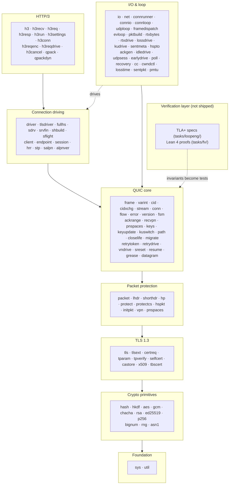
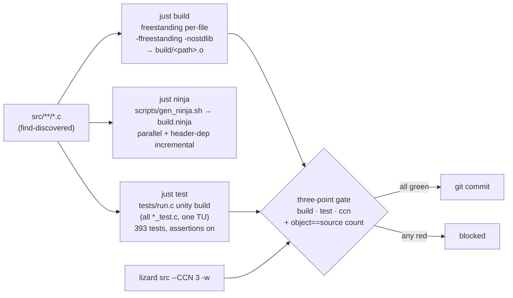
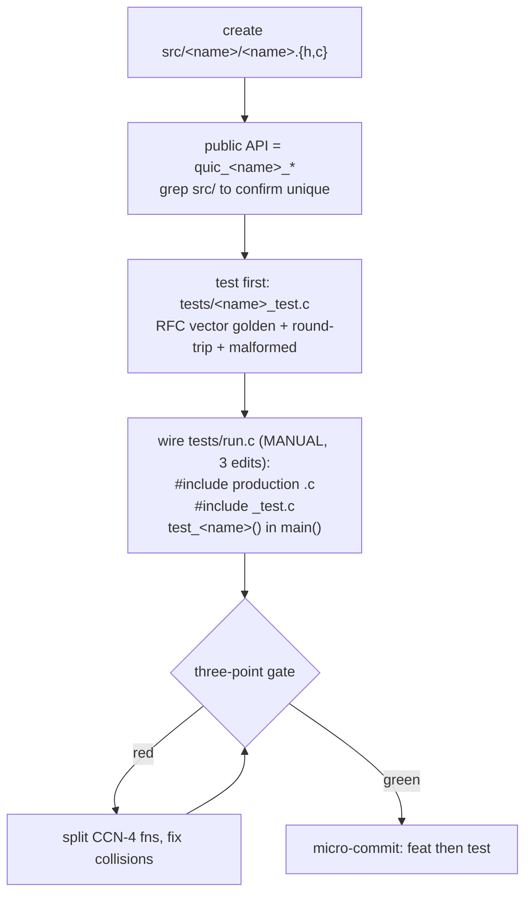
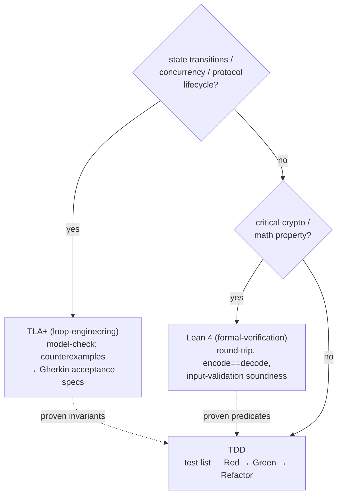

# Development

How to understand, navigate, and extend `wired`: the design philosophy, the
layered architecture, the build system, the constraints every change must hold,
and the workflow for adding a domain.

## Philosophy

`wired` is a QUIC + HTTP/3 stack built under three self-imposed disciplines:

- **libc-free, freestanding.** Every production source compiles under
  `-ffreestanding -nostdlib`. The only thing `src/` may include is
  `sys/syscall.h` (direct x86_64-linux syscalls) and `util/*` (a handful of
  inline primitives). No `<stdio.h>`, no `<string.h>`, no CRT. The compile
  itself is the proof of independence.
- **Low complexity by construction.** Every function has cyclomatic complexity
  ≤ 3 (lizard-enforced). This is not a style preference: it forces small
  functions, table-driven dispatch, and predicate helpers, which keeps each
  codec auditable against its RFC.
- **Verification-driven.** State machines are model-checked (TLA+) and critical
  crypto/math is proved (Lean 4) *before* implementation; the resulting
  invariants become the golden tests. RFC behavior is implemented against the
  IETF primary source with self-recomputed test vectors.

## Architecture

The codebase is 124 domains, one per `src/<dir>/`, stacked in dependency layers.
Higher layers depend on lower ones; the I/O layer sits to the side and drives
the loop; the verification layer is tooling kept out of the shipped binary.



To find code: one concern lives in exactly one `src/<dir>/` (MECE). The
directory name is the domain; its public API is prefixed `quic_<domain>_`. So
`grep -rn 'quic_stream_' src/stream/` is the whole story for stream framing,
and a new behavior belongs in the layer whose responsibilities it matches.

## Build system

`just` drives three build modes off the same source tree and the same cflags
(defined once in the `justfile`). Sources are auto-discovered, so adding a
`src/**/*.c` file needs no justfile edit.



- **`just build`** compiles each `.c` individually under `-ffreestanding
  -nostdlib` into a path-qualified `build/<path>.o`. This is the proof of libc
  independence: if a file needs a standard header, the build fails — fix the
  code, don't add the header. The path-qualified `.o` also lets the count check
  work despite shared basenames (`frame.c`, `grease.c`, …).
- **`just ninja`** generates `build.ninja` and does parallel, header-aware
  incremental rebuilds — the fast inner loop while iterating.
- **`just test`** compiles `tests/run.c`, a single unity translation unit that
  `#include`s every production `.c` once and every `*_test.c` once, then runs
  all 393 tests with assertions on.
- **`just check`** runs the gate (`ccn` + `test`); the full commit gate adds
  `just build` and the object-count check (see below).
- **`just setup`** bootstraps a fresh machine: installs nix via the
  Determinate Systems installer when absent (no-op when present). `nix develop`
  then provides clang/just/lizard/doxygen from `flake.nix`. Without just
  itself, run the installer line from the `setup` recipe directly.
- **`just docs`** regenerates the public-API reference (doxygen, config in
  `docs/Doxyfile`) into `docs/sdk/` (gitignored). The input set is derived from
  `wired.h`'s transitive includes at run time, and `WARN_AS_ERROR` is on: a
  declaration added to a public header without a doxygen comment fails the run.

## Hard constraints

A change that breaks any of these is not done.

- **No libc, no CRT.** Production sources compile under `-ffreestanding
  -nostdlib`. Do not include `<stdio.h>`, `<string.h>`, etc. in `src/`. Write
  your own small byte loops, or use the existing `util/*` inline helpers
  (`bytes.h`, `be.h`, `ct.h`, `num.h`) — never re-roll `memcpy`/`put_be32`/a
  constant-time compare a second time. Verify: `just build`.
- **CCN ≤ 3 for every function.** `lizard` counts `&&`, `||`, `?:`, `if`,
  `for`, `while` as +1 each. Factor compound conditions into named predicate
  helpers and branch clusters into table + function-pointer dispatch. Count
  branches *before* writing. Verify: `lizard src --CCN 3 -w`.
- **MECE: one domain, one `src/<dir>/`.** Don't scatter a concern across dirs
  or merge two concerns into one dir.
- **Unity build = one global namespace.** Because `tests/run.c` links the whole
  repo as a single TU, *every* symbol — public function, `static` helper,
  `typedef`, macro, constant — is globally unique. Public API gets a
  `quic_<domain>_` prefix; grep `src/` before adding a name. A duplicated
  `static` helper is a link collision, not a private detail — hoist it to
  `util/*` as `inline`. Verify: `just test`.

### The three-point gate

A commit is allowed only when all three pass in the same working tree, plus the
count check. Run them guarded so a red result cannot reach `git commit`:

```sh
if just test 2>&1 | grep -q "all tests passed" \
   && just build >/dev/null 2>&1 \
   && lizard src --CCN 3 -w \
   && [ "$(find src -name '*.c' | wc -l)" = "$(find build -name '*.o' | wc -l)" ]; then
    git commit -m "..."
fi
```

Never pipe a gate into `tail`/`head` and `&&` a commit on the pipe's exit (the
exit is the pager's). Never `;`-chain a gate and a commit. The count check
catches a source that silently never got compiled — objects must equal sources.

## Adding a domain

A domain is `src/<name>/<name>.h` (types, constants, prototypes) +
`src/<name>/<name>.c` (implementation with `static` helpers).



The `justfile` finds `src/**/*.c` automatically, but **`tests/run.c` is
hand-edited** — a new domain needs all three edits there or it is committed but
never built or tested. After editing `run.c`, grep to confirm the edit landed,
then run the object-count check.

## Verification layers

Decide the layer in planning, before writing code. Three layers, three jobs —
don't mix them and don't overuse them (TLA+/Lean on trivial logic is
over-engineering).



- **State transitions / concurrency / protocol lifecycle → TLA+.** The specs in
  `tasks/loopeng/` exhaustively explore stream / connection / handshake /
  PN-space / close-and-draining / key-update / path / version-negotiation /
  Retry-reconnection / HTTP/3-control state, with zero surviving mutants.
  Counterexamples become acceptance specs.
- **Critical crypto / math → Lean 4.** The proofs in `tasks/fv/` establish
  varint, packet-number, AEAD, cwnd, RTT, and the Ed25519 signature equation
  with no `sorry`.
- **Everything else → TDD.** Test list first → Red (confirm it fails) → minimal
  Green → Refactor.

Properties proven in the top two layers become 1:1 predicates in the TDD test
list. Both layers' artifacts live in `tasks/` and are kept out of the shipped
repo; what lands is the verified code and the tests derived from it.

## Test strategy

`tests/run.c` is the single unity TU: it `#include`s each production `.c` and
each `*_test.c` exactly once, so tests exercise real implementation code (not a
mock) and symbol collisions surface immediately. Each domain's test covers, per
the RFC, the test-design viewpoints:

- **Official golden vector.** The RFC/FIPS published vector, re-derived by hand
  before being baked in — external snippets have been wrong (a mis-XORed nonce,
  a truncated ClientHello). When a full golden vector can't be retrieved, prove
  correctness with round-trip + known sub-component vectors + hand-computed
  parts, never a single faked match.
- **Encode/decode round-trip.** Encode then decode returns the input.
- **Boundary values & equivalence partitioning.** Lengths, offsets, varint
  size classes, ODCID edge lengths.
- **Malformed-input rejection.** Truncated, tampered, and out-of-range inputs
  are rejected, not silently accepted.

## Workflow

1. **Read the RFC first.** Find the published test vector before writing code.
2. **Test first.** Add `tests/<domain>_test.c` with the golden assertion plus
   round-trip and malformed cases; wire it into `run.c` and confirm it fails.
3. **Implement minimally.** Smallest code that passes and stays CCN ≤ 3. Reuse
   `util/*`, varint cursors, and the `fsm` engine before adding helpers.
4. **Keep the gate green.** When a function hits CCN 4, split out a predicate or
   sub-step helper.
5. **Micro-commit.** ~30–50 line conventional commits with an RFC section
   reference; keep `feat(<domain>):` and `test(<domain>):` as distinct commits.
</content>
</invoke>
