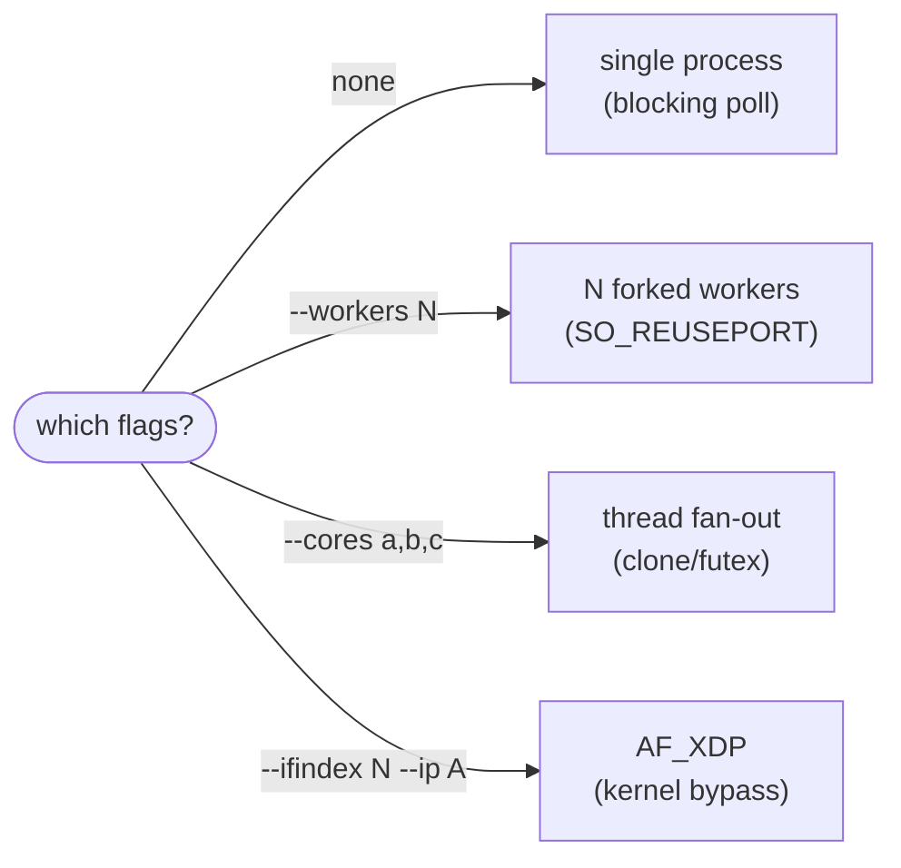

# Getting Started

From nothing to a running HTTP/3 server, then to a server of your own.

This page is in three parts — you can stop after any of them:

| Part | What you get | Time |
|---|---|---|
| [1. First five minutes](#part-1-first-five-minutes) | The example server running, answering real HTTP/3 requests | ~5 min |
| [2. A server of your own](#part-2-a-server-of-your-own) | Your own binary linked against the SDK | ~15 min |
| [3. Going further](#part-3-going-further) | I/O drivers, WebTransport, certificates, observability | as needed |

## Part 1: First five minutes

### Install the toolchain

`wired` targets **x86_64-linux only**. One command installs everything
(clang, just, lizard, doxygen — the exact versions CI uses), pinned by a
[Nix](https://nixos.org/) flake so your build matches CI's:

```sh
just setup     # one-time: installs Nix (Determinate Systems installer) if absent
nix develop    # enter the pinned devShell
```

> **No Nix?** Install `clang`, `just`, and `lizard` yourself. A host
> `clang-format`/`clang-tidy` of a different version can disagree with CI's
> pinned one — run formatting and lint through `just nix <recipe>` when in
> doubt.

### Build and test

```sh
just build     # format + compile + lint
just test      # run the whole test suite
```

Both should end green. (`just check` is the pre-commit combination:
complexity gate + tests.)

### Run the example server

```sh
cd examples/word_list
just run       # builds the SDK + the sample, binds 0.0.0.0:4433
```

Then, from a machine that can reach UDP port 4433:

```sh
curl --http3-only --insecure https://<host>:4433/
```

If your local curl lacks HTTP/3 support, use the Docker one:

```sh
docker run --rm ymuski/curl-http3 \
    curl --http3-only --insecure -v https://<host>:4433/
```

**Checkpoint** — you have a working HTTP/3 server. The other samples run the
same way; see [examples/](../examples/) for all four: an HTTP/3 message-log /
static-file server ([word_list](../examples/word_list/)), a WebTransport
building-blocks demo ([webtransport_echo](../examples/webtransport_echo/)),
a browser chat over WebTransport DATAGRAMs
([webtransport_chat](../examples/webtransport_chat/)), and a
[quic-interop-runner](https://github.com/quic-interop/quic-interop-runner)
WebTransport server endpoint
([webtransport_interop](../examples/webtransport_interop/)).

<details>
<summary>Reference: every <code>just</code> recipe</summary>

| Recipe | What it does |
|---|---|
| `setup` | One-time bootstrap: install Nix if absent. |
| `nix <recipe>` | Run any recipe inside the pinned flake devShell. |
| `build` | `fmt` + `ninja` + `lint` as one pipeline. |
| `ninja` | Compile every `src/**/*.c` with `-ffreestanding -nostdlib` into `build/<path>.o` — the proof of libc independence. |
| `lib` | Archive the SDK objects into `build/libwired.a` (excludes the SDK's own `_start` stub so your app supplies the entry point). |
| `test` | Format, then build and run `build/quic_test`: `tests/run.c` is a single unity translation unit including every production `.c` and every `*_test.c`, assertions on. |
| `ccn` | `lizard src --CCN 3 -w` — every function must hold cyclomatic complexity ≤ 3. |
| `check` | `ccn` + `test`. |
| `fmt` / `fmt-check` | clang-format in place / verify without writing. |
| `lint` / `cert` | clang-tidy static analysis (CERT C secure-coding rules + bug finders / CERT C only). |
| `fuzz-header` / `fuzz-qpack` / `fuzz-x509` | Build one libFuzzer+ASan harness (packet header, QPACK, X.509). |
| `fuzz-ci [secs]` | Run all three harnesses for `secs` seconds each (default 120). |
| `docs` | Regenerate the doxygen API reference into `docs/sdk/` from `wired.h`'s transitive includes. |
| `gen-ninja` / `compdb` | Regenerate `build.ninja` / emit `compile_commands.json` for clangd. |

</details>

## Part 2: A server of your own

### Link against the SDK

Build the static library, then compile your application freestanding against
`src/` as the include root and link `build/libwired.a`:

```sh
just lib
clang -target x86_64-linux-gnu -ffreestanding -fno-stack-protector \
      -fno-builtin -nostdlib -static \
      -Isrc -o my_server my_server.c build/libwired.a
```

One translation unit defines `WIRED_MAIN` before including `wired.h`; that
emits the `memcpy`/`memset` shim a `-nostdlib` binary needs plus the `_start`
entry stub, which recovers `argc`/`argv` from the kernel stack and calls your
`wired_main`:

```c
#define WIRED_MAIN
#include "wired.h"
#include "app/http3/server/srvdriver/srvdriver.h" /* driver selection */
#include "common/platform/exit/exit.h"            /* wired_die */

int wired_main(int argc, char** argv);
```

Note `srvdriver.h` (driver selection) and `exit.h` (`wired_die`) are included
separately from `wired.h` — the examples do exactly this.

### A minimal server

Three pieces, then one call (`examples/word_list/wired_server.c` is the full
worked version):

**1. The request handler** — answer each decoded HTTP/3 request by filling a
body buffer:

```c
static int app_on_request(
    void*                       ctx,
    const wired_h3reqdrive_req* req,   /* method/path/body views */
    quic_obuf*                  body_out,
    const char**                content_type) {
  /* write the response body into body_out, set *content_type */
  return 1;
}
```

**2. The server identity** (`wired_srvboot_id`) — the X25519 handshake key
pair, the signing seed for the self-signed ECDSA P-256 certificate, a source
connection ID, and the ServerHello random. The example's `server_identity()`
fills it from fixed demo seeds; a production server derives per-run keys.

**3. Parse the CLI and run.** `wired_srvdriver_parse` resolves `--port` and
the I/O-driver selection flags into a `wired_srvdriver_opt`;
`wired_srvdriver_run` dispatches to the selected driver and serves until
SIGTERM:

```c
int wired_main(int argc, char** argv) {
  wired_srvboot_id     id;
  wired_srvdriver_opt  opt;
  wired_srvrun_handler h   = {app_on_request, /*ctx=*/0};
  wired_srvrun_obs     obs = {0}; /* qlog/keylog/cert-reload paths, all off */

  server_identity(&id);  /* fill the wired_srvboot_id (see examples/) */
  if (!wired_srvdriver_parse(argc, argv, &opt)) wired_die("bad flags\n");
  if (!wired_srvdriver_run(&id, h, obs, &opt)) wired_die("listen failed\n");
  return 0;
}
```

A caller that does not want CLI parsing can skip `wired_srvdriver_parse` and
call `wired_server_run(port, &id, h, obs)` (single-process, blocking `poll`)
directly.

**Checkpoint** — you have your own HTTP/3 server binary. Everything below is
opt-in.

## Part 3: Going further

### Choosing an I/O driver

`wired_srvdriver_parse` selects one of four run paths from the flags. All
four drive the same application callback — pick by how much throughput you
need and how much setup you can afford:



| Driver | Select with | Extra flags | Notes |
|---|---|---|---|
| Single-process (default) | no flag | `--pin-core N` | Blocking `poll(2)` loop; simplest. `--pin-core` pins the process to CPU N. |
| Multi-process fork | `--workers N` | `--pin-cores 1` | N `fork`ed workers sharing the port via `SO_REUSEPORT`; a supervisor re-forks a dead worker. `0` = CPU count. `--pin-cores 1` pins worker *i* to CPU *i*. |
| Multi-thread | `--cores a,b,c` | `--control-core N` | `clone(2)`/`futex(2)` fan-out (no pthreads); worker *i* pins to `cores[i]`. `--control-core` pins the control thread to CPU N. |
| AF_XDP | `--ifindex N --ip a.b.c.d` (both required) | `--queue N --skb-mode` | Packets polled from a shared UMEM ring, zero per-packet syscalls on receive. Root and kernel ≥ 5.9 (`BPF_LINK_CREATE` for XDP) required. |

Rules enforced by the parser: `--workers` cannot combine with `--cores` or
`--ifindex`; `--pin-core` is rejected alongside `--workers`/`--cores` (each
has its own pinning flag) and only the single-process driver applies it. `--cores`
**plus** `--ifindex` is AF_XDP multi-queue mode (worker *i* serves NIC queue
*i* against one shared BPF filter).

`--port` (default 4433) lives in the same parse: the port the server binds
and, for AF_XDP, the port the BPF redirect filter matches — one value, so
they cannot drift apart.

> **AF_XDP caveats:** the NIC must have as many RX queues as `--cores`
> entries (`ethtool -l`); `--skb-mode` (generic XDP) works on drivers
> without native XDP support, but some virtualized NICs (e.g. `virtio_net`)
> do not deliver AF_XDP TX in generic mode — prefer the plain UDP driver
> there.

### WebTransport

The server loop delivers WebTransport events through optional callbacks on
`wired_srvrun_opt` (reachable as `opt.run` on the driver options):

```c
opt.run.wt_on_datagram    = my_datagram_cb;   /* one QUIC DATAGRAM per call */
opt.run.wt_on_stream_data = my_stream_cb;     /* reassembled WT stream bytes */
```

Extended CONNECT establishes the session in the SDK; your callback receives
the `wired_wt_session*` it belongs to. `wired_server_broadcast_datagram(data)`
fans one DATAGRAM out to every active session — the whole chat relay in
`examples/webtransport_chat` is that one call.

### Certificates

By default the server builds a **self-signed ECDSA P-256** certificate at
startup from `id.cert_seed`. To serve a CA-issued chain instead:

```c
static wired_certreload_store store;
wired_certreload_load_or_selfsigned(cert_path, key_path, &store, &id);
```

- `cert.pem` is a fullchain, leaf first, at most 2 certificates.
- `key.pem` is an ECDSA P-256 private key (SEC1 or unencrypted PKCS#8).
  RSA and Ed25519 server keys are not supported.
- Paths unset → self-signed as before. Set but unloadable → the process dies
  at startup rather than silently falling back.

Passing the same paths in `wired_srvrun_obs.cert_path`/`.key_path` also
enables **SIGHUP hot reload**: the PEM pair is re-read and the identity
updated in place; connections already past their handshake are undisturbed.

### Observability

`wired_srvrun_obs` carries optional debug outputs, each `0` to disable:

- `qlog_path` — RFC 9002-shaped `packet_sent`/`packet_received` events,
  JSON-SEQ framed.
- `keylog_path` — NSS key log (`SSLKEYLOGFILE` format), for decrypting a
  capture in Wireshark.
- `cc_algo` — congestion-control algorithm: `0` = NewReno (the default),
  `1` = CUBIC, `2` = BBR.

The examples map these to `--qlog-file`/`--keylog-file` flags.

---

**Next:** how the stack works inside →
[Architecture and Data Flow](arch/overview.md) · building against the SDK →
[API Stability](api-stability.md) · all pages →
[documentation index](README.md)
