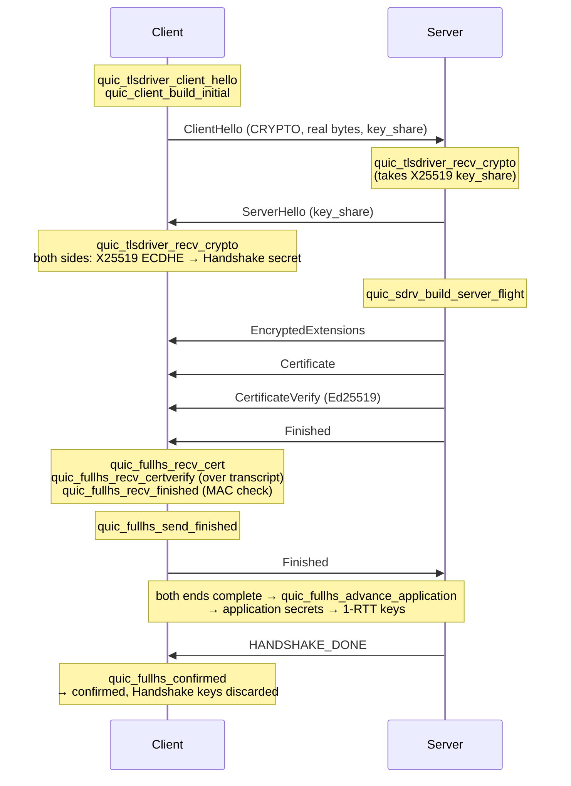
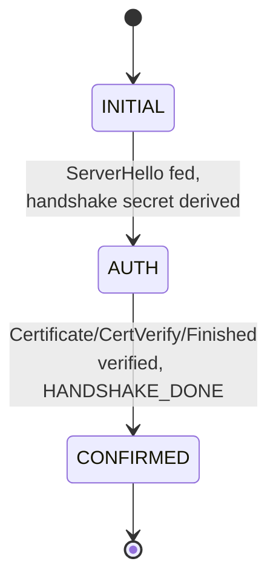
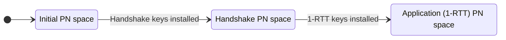

# Usage

How to build `wired`, run its tests, and use the library.

## Toolchain

A Nix flake provides everything (`clang`, `just`, `lizard`):

```sh
nix develop
```

Without Nix, install `clang`, `just`, and `lizard` yourself; the build targets
`x86_64-linux` only.

## just targets

```sh
just build   # compile every domain freestanding into build/*.o
just test    # build and run the hosted test suite
just ccn     # fail if any function exceeds cyclomatic complexity 3
just check   # ccn + test (use this before committing)
```

- `just build` compiles every domain with `-ffreestanding -nostdlib`, which is
  what proves the library is libc-free. The result is a set of `.o` files plus
  a freestanding `_start`.
- `just test` rebuilds the same sources in a hosted configuration so they can
  be exercised with assertions. The test harness is a tiny assert macro
  (`tests/test.h`); each domain has one `*_test.c`, all driven by
  `tests/run.c`.

## What this SDK does

`wired` is a libc-free QUIC / TLS 1.3 toolkit. The in-memory path derives
keys, runs a real X25519 ECDHE TLS 1.3 handshake, protects and opens QUIC
packets, and verifies the handshake transcript — without touching a socket. A
separate socket-facing path (`connrunner`) binds the steady-state loop to a real
UDP socket and drives retransmission, key update, Retry/VN reconnection, and
per-PN-space send/receive; sockets live in the optional `io/udp` and are not on
the in-memory path.

The substance is the verified building blocks; the handshake and session
drivers are worked examples of how they compose. Each piece is checked against
official test vectors (see [Correctness](#correctness)).

Where each layer fits:

- **Cryptography** — SHA-256/HMAC/HKDF, AES-128-GCM, ChaCha20-Poly1305,
  X25519, Ed25519 — each verified against published vectors.
- **Packet protection** — derive Initial keys, seal/open Initial, Handshake
  and 1-RTT packets (`initpkt`, `hspkt`, `protectcs`).
- **TLS 1.3 handshake** — agree the ECDHE secret over real ClientHello/
  ServerHello bytes (`tlsdriver`), then sequence Certificate/CertificateVerify/
  Finished to completion and confirmation (`fullhs`); `client` wires those to a
  socket, `sdrv` builds the server flight.
- **Session** — a high-level in-memory client/server exchange (`session`).

## The TLS 1.3 handshake flow

The full flight is driven and verified in-memory by `tlsdriver_test`,
`sdrv_test`, `fullhs_test`, and `client_test`. The annotations show which API
produces or consumes each message.



`tlsdriver` carries the ClientHello/ServerHello and agrees the ECDHE shared
secret; `fullhs` picks up from the derived handshake secret and drives the
authentication flight (Certificate → CertificateVerify → Finished) to
completion, installs the 1-RTT keys, and confirms on HANDSHAKE_DONE.

## Handshake state and packet-number spaces

The handshake advances forward only: `INITIAL → AUTH → CONFIRMED` (the
`QUIC_CLIENT_HS_*` phases). There is no path back.



Each handshake step lives in its own packet-number space; the three spaces
number packets independently (RFC 9000 §12.3):



The connection lifecycle is likewise forward-only — `open → Closing →
Draining → Closed` — with no backward transitions (RFC 9000 §10,
`closelife`).

## Using the library

Each domain is a directory with a `.h` (types, constants, prototypes) and a
`.c` (implementation). Include the header you need, e.g. `#include
"varint/varint.h"`, and link the matching `.o` from `just build`. The examples
below use the real function signatures; see the matching `*_test.c` for full
worked flows.

### (a) The high-level session API (start here)

`session/session.h` is the entry point if you just want a working QUIC
exchange. A client and a server complete a handshake and exchange protected
1-RTT data over an in-memory link — no sockets, no kernel network stack:

```c
#include "session/session.h"

quic_memlink link;
quic_memlink_init(&link);

quic_session cli, srv;
quic_session_init(&cli, client_priv, dcid, &link, /*is_server=*/0);
quic_session_init(&srv, server_priv, dcid, &link, /*is_server=*/1);

/* handshake: ClientHello over the link, server accepts, both agree keys */
quic_session_client_hello(&cli);
quic_session_accept(&srv);
quic_session_finish(&cli, &srv, transcript, transcript_len);

/* protected 1-RTT STREAM data, either direction */
quic_session_send_stream(&srv, /*stream_id=*/4, (const u8*)"hello", 5, /*fin=*/1);
quic_stream_frame got;
quic_session_recv_stream(&cli, &got);   /* got.data == "hello" */
```

This is a real handshake (X25519 ECDHE + the TLS key schedule) and real
AEAD-protected packets carried as IPv4/UDP over the memlink; it is **not** a
loopback shortcut. It carries a minimal ClientHello rather than a full TLS 1.3
negotiation, and it exchanges one STREAM frame per call rather than running a
packet-scheduling loop. For a full TLS 1.3 message flow, use the
`tlsdriver`/`fullhs`/`client` path below.

### (b) Driving the handshake to confirmed (`client`)

`quic_client` orchestrates `tlsdriver` and `fullhs`. The data path is
socket-free and can be driven by buffer injection (`quic_client_feed`), so the
same logic the socket pump uses can be exercised without a socket. This mirrors
`tests/client_test.c`:

```c
#include "client/client.h"

quic_client c;
quic_tlsdriver_init(&c.tls, my_priv, my_pub, /*is_server=*/0);

/* (1) build the Initial datagram: ClientHello as CRYPTO, padded to 1200 */
u8 dg[QUIC_CLIENT_DATAGRAM_MAX];
usz n = quic_client_build_initial(&c, dg, sizeof(dg));   /* n == 1200 */

/* (2) feed each inbound TLS message (CRYPTO payload). Dispatched by phase:
 *     ServerHello -> tlsdriver (INITIAL -> AUTH), then
 *     Certificate / CertificateVerify / Finished -> fullhs (-> CONFIRMED). */
quic_client_feed(&c, server_hello, sh_len);      /* phase -> AUTH */
quic_client_feed(&c, cert_msg, cert_len);
quic_client_feed(&c, cert_verify, cv_len);
quic_client_feed(&c, server_finished, fin_len);

/* (3) once confirmed: */
if (quic_client_is_connected(&c)) { /* 1-RTT ready */ }
```

With a real socket, `quic_client_init` opens the UDP socket and generates the
X25519 key pair, `quic_client_start` sends the Initial, and
`quic_client_run_handshake(&c, max_iterations)` pumps the socket until
confirmed (bounded so a silent or hostile peer cannot wedge the client).

The server side builds its flight with `quic_sdrv_recv_client_hello` then
`quic_sdrv_build_server_flight` (ServerHello + EncryptedExtensions +
Certificate + CertificateVerify + Finished); see `tests/sdrv_test.c`.

### (c) Packet protection round-trip (`initpkt`)

Build a protected client Initial from a DCID and open it back with the same
DCID — seal then open is the identity on the CRYPTO payload (RFC 9001 §5.2,
Appendix A keys). From `tests/initpkt_test.c`:

```c
#include "initpkt/initpkt.h"
#include "initpkt/initopen.h"

const u8 dcid[8] = {0x83,0x94,0xc8,0xf0,0x3e,0x51,0x57,0x08};
const u8 scid[4] = {0xde,0xad,0xbe,0xef};
const u8 ch[]    = "ClientHello";

u8 pkt[1300];
usz total;
quic_initpkt_build(dcid, 8, scid, 4, ch, sizeof(ch) - 1, /*pn=*/2,
                   pkt, sizeof(pkt), &total);   /* total >= 1200 */

const u8 *crypto;
usz clen;
quic_initpkt_open(dcid, 8, pkt, total, /*pn=*/2, &crypto, &clen);
/* crypto[0] == 0x06 (CRYPTO frame), payload follows */
```

A single tampered byte makes `quic_initpkt_open` return 0 (AEAD
authentication). Handshake and 1-RTT packets use `quic_hspkt_build` /
`quic_hspkt_open`; suite-aware seal/open (AES-128-GCM `0x1301` or
ChaCha20-Poly1305 `0x1303`) is `quic_protectcs_seal` / `quic_protectcs_open`.

### (d) Self-signed Ed25519 certificate (`selfcert`)

Build a self-signed Ed25519 X.509 certificate from a 32-byte seed, then parse
it back and verify its own signature (RFC 5280 §4.1, RFC 8410). From
`tests/selfcert_test.c`:

```c
#include "selfcert/selfcert.h"
#include "x509/x509.h"

u8 cert[1024];
usz clen;
quic_selfcert_build(seed, cert, sizeof(cert), &clen);

quic_x509 c;
quic_x509_parse(cert, clen, &c);
/* c.tbs / c.tbs_len is the signed body; c.sig the Ed25519 signature.
 * quic_x509_public_key(c.tbs, c.tbs_len, ...) exposes the 32-byte key. */
```

This cert is what `sdrv` sends in its Certificate message and what
`quic_fullhs_recv_certverify` authenticates. Root CAs are held in `castore`;
chains parse through `x509`.

### Building blocks

The pieces compose bottom-up. A few representative entry points:

- **Codecs** return the number of bytes written/consumed, or `0` on
  overflow/truncation — e.g. `quic_varint_encode`, `quic_frame_put_stream`,
  `quic_ack_encode`.
- **AEAD** seals/opens in place and rejects tampering:
  `quic_gcm_seal`/`quic_gcm_open`, `quic_chapoly_seal`/`quic_chapoly_open`.
  `open` leaves the plaintext buffer untouched on authentication failure.
- **Packet protection** ties the layers together:
  `quic_protect_seal` builds the nonce (`iv XOR pn`), AEAD-seals the payload
  with the header as AAD, then applies header protection; `quic_protect_open`
  reverses it.
- **Key derivation**: `quic_initpkt_derive` for Initial keys (RFC 9001
  Appendix A), `quic_x25519`/`quic_x25519_base` for ECDHE, and the key schedule
  for the handshake/application secrets.

### End to end, without the kernel

`endpoint/` drives a complete handshake with no sockets and no kernel network
stack. The client builds a ClientHello, frames it as CRYPTO, protects it as an
Initial packet, wraps it in UDP/IPv4, and pushes it onto an in-memory link
(`net/memlink`); the server reads it back with zero syscalls, recovers the
X25519 share, and both sides run ECDHE and the TLS key schedule to the same
handshake keys. A 1-RTT STREAM then round-trips under those keys.

The data path makes no `socket`/`sendto`/`recvfrom` calls — sockets live only
in an optional `io/udp` that the end-to-end path does not use. See
`tests/endpoint_test.c` for the full worked flow.

## Cryptographic primitives

Every primitive is verified against its published vector and can be used
directly:

| Primitive | API | Vector |
|-----------|-----|--------|
| SHA-256 | `quic_sha256` | NIST |
| HMAC-SHA-256 | `quic_hmac_sha256` | RFC 4231 |
| HKDF / Expand-Label | `quic_hkdf_extract`, `quic_hkdf_expand_label` | RFC 5869 / 8446 |
| AES-128 / -GCM | `quic_aes128_*`, `quic_gcm_seal`/`quic_gcm_open` | FIPS 197 / SP 800-38D |
| ChaCha20-Poly1305 | `quic_chapoly_seal`/`quic_chapoly_open` | RFC 8439 |
| X25519 | `quic_x25519`, `quic_x25519_base` | RFC 7748 |
| Ed25519 | `quic_ed25519_keypair`, `quic_ed25519_verify` | RFC 8032 |

The AEADs leave the plaintext untouched and return 0 when the ciphertext, AAD,
or tag is tampered.

## Correctness

Every codec is checked against official test vectors and has round-trip and
truncated-input tests:

- Transport codecs against the RFC 9000 Appendix A sample vectors. The
  packet-number recovery window boundary is pinned, including the case at
  exactly half a window where recovery deliberately does not match.
- Cryptography against the published vectors for each primitive (table above).
  The AEADs reject tampered ciphertext, AAD, or tags.
- The RFC 9001 Appendix A Initial keys and the §5.4.2 header-protection mask
  match byte for byte, exercising the whole HKDF → AEAD → header-protection
  stack together.
- Recovery and congestion control against the RFC 9002 formulas, with the
  packet-loss threshold boundary and the `cwnd >= kMinimumWindow` floor pinned.
- The IPv4/UDP stack against the RFC 1071 checksum example, with build/verify
  round-trips and a full datagram carried across the in-memory link.

## Scope

Implemented end to end: the transport wire format and the complete frame set
(including ACK with ECN, RESET_STREAM/STOP_SENDING, the flow-control and
*_BLOCKED frames, NEW_TOKEN, RETIRE_CONNECTION_ID, PATH_CHALLENGE/RESPONSE,
HANDSHAKE_DONE, and a frame-type classifier); short-header build, Retry, and
Version Negotiation packets; the full transport-parameter set; transport
error codes; stream/connection state machines; the full cryptography stack
with RFC 9001 Initial/handshake key derivation and the Retry Integrity Tag;
the packet protection pipeline; loss recovery and congestion control; flow
control and reassembly; a userspace IPv4/UDP stack over an in-memory link;
a kernel-free endpoint that establishes a handshake and exchanges 1-RTT data;
and a real TLS 1.3 message flow (`tlsdriver` ECDHE agreement, `sdrv` server
flight, `fullhs` Certificate/CertificateVerify/Finished to confirmation,
`client` driving it to confirmed).

Also implemented, each verified against its RFC: the 1-RTT key update (key
phase, old-key retention, AEAD limits) driven over the real send/receive path,
path validation and connection migration with UDP send-target swap, the
connection close / draining / idle-timeout lifecycle (per-phase send gating, a
3·PTO close timer, and a once-only graceful close notification), version
negotiation with downgrade protection and QUIC v2, compatible version
negotiation (RFC 9368), the unreliable DATAGRAM extension (RFC 9221),
grease_quic_bit (RFC 9287), Ed25519 signature verification (RFC 8032) with
Certificate/CertificateVerify parsing and full TBSCertificate field parsing
(RFC 5280), self-signed Ed25519 certificate build (`selfcert`), 0-RTT key
derivation with resumption / early-data eligibility, the Initial DCID/SCID
exchange with original_destination_connection_id transport-parameter
verification, stateless reset, coalesced packet splitting, per-PN-space
send/receive, sent-packet metadata with in-flight accounting feeding real-byte
loss retransmission, loss recovery (PTO including the handshake special case,
ECN, pacing, persistent congestion) and the full congestion-control phases, and
the HTTP/3 stack (frame codec, control / SETTINGS / GOAWAY state machine,
request-stream framing, pseudo-headers, priorities, request cancellation via
RESET_STREAM) with QPACK static *and* dynamic tables — real request/response
HEADERS are QPACK-encoded and decoded over a 1-RTT stream round trip —
integer/string/field-line codecs, SNI and ALPN extension codecs, and ALPN /
version interaction.

Verified across the whole tree: every function holds cyclomatic complexity
<= 3, all sources compile freestanding (no libc), and the full test suite
runs in one hosted translation unit.

## Not implemented (deliberate)

These are intentionally out of scope and remain so even in the finished form;
they are noted in code:

- **Real sockets on the main session path.** `session`/`endpoint` never speak to
  a real socket — they are kernel-free. The socket-facing path is `connrunner`
  (which binds the loop to `io/udp`) and the UDP example; the in-memory session
  is kernel-free by design.
- **Full TLS 1.3 negotiation in `session`.** The `session` layer carries a
  minimal ClientHello, not a full negotiation. The full TLS 1.3 message flow
  lives in `tlsdriver`/`fullhs`/`client`.
- **`curl --http3` interop (quiche backend confirmed).** A real `curl --http3`
  round trip was completed against `examples/wired_server` on an external host
  (VPS): the quiche / BoringSSL backend finished the handshake and received
  `HTTP/3 200`. It was not run in this sandbox (no HTTP/3 curl here), and curl's
  ngtcp2 backend / other clients are not yet verified.
- **Full X.509 chain / path validation.** The certificate is parsed (the whole
  TBSCertificate is structured) and its Ed25519 signature is verified over the
  transcript; trust-chain building and path validation beyond that are not done.
- **0-RTT replay protection.** 0-RTT key derivation and the resumption /
  early-data eligibility drive exist, but anti-replay defense does not.
- **CID-rotation privacy policy** (RFC 9000 §10.11) — the CID-switch machinery
  exists; *when* to rotate for unlinkability is an operational policy, left out
  of the SDK.

The endpoint, handshake, and connection drivers prove transport key agreement,
encrypted data exchange, and Ed25519 handshake authentication — not full PKI
authentication.
</content>
</invoke>
