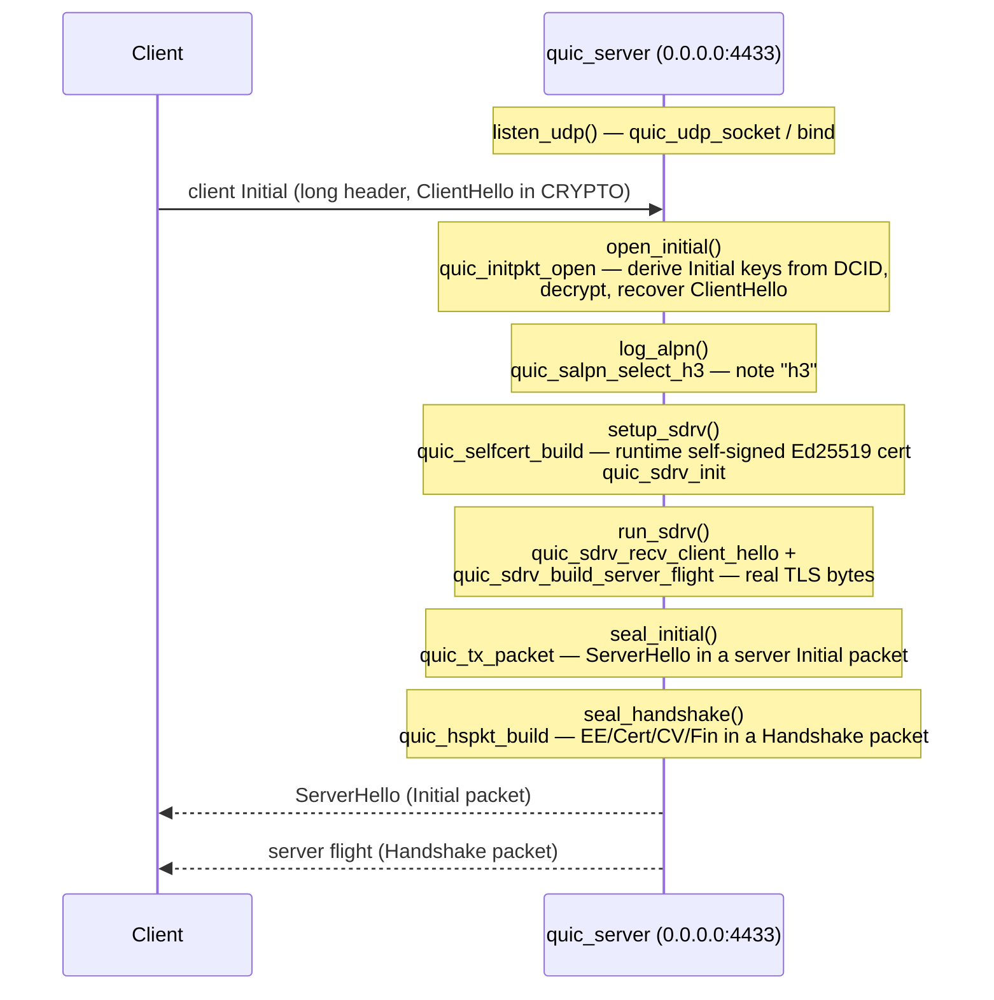

# Real-UDP QUIC server sample

`quic_server.c` is a minimal QUIC server that receives a real client `Initial`
packet over a real UDP socket, assembles a TLS 1.3 server flight from the
repository's own building blocks, and sends it back. It is libc-free,
x86_64-linux only, and runs on direct syscalls with its own `_start` (a static,
freestanding binary).

## Overview

The server does exactly one round of the QUIC handshake: it accepts a client
`Initial`, decrypts it, negotiates ALPN, builds a runtime self-signed
certificate, generates the **real TLS 1.3 bytes** of the server flight
(ServerHello + EncryptedExtensions / Certificate / CertificateVerify /
Finished, RFC 8446 4.4), seals them into QUIC packets, and returns them. It
does **not** serve HTTP/3, install 1-RTT keys, or receive the client Finished.
Those are out of scope for this sample — the full steady-state drive (loss
retransmission, key update, Retry / Version-Negotiation reconnection,
per-PN-space send/receive over a real UDP socket) lives in the `connrunner`
domain; this sample is deliberately a single handshake round.

## Server flow



Each step also logs a line to stderr (`Initial received and opened`,
`ALPN: h3 selected`, `certificate built`, `server flight built`,
`ServerHello (Initial) sent`, `server flight (Handshake) sent`).

The packet codec emits the complete RFC 9000 17.2 long header (DCID, SCID,
Initial Token, Length, packet number).

## Build and run

```sh
cd examples
nix develop          # provides clang / just / tcpdump
just run             # builds and starts on 0.0.0.0:4433
```

`just build` alone produces the `examples/quic_server` binary. On startup the
server prints `listening on 0.0.0.0:4433` and blocks in `recvfrom`. Stop it with
Ctrl-C.

## Connecting from outside (honest)

### `curl --http3`

```sh
curl --http3 --insecure https://127.0.0.1:4433/
```

The server emits the same wire form a real client sends, and the repository's
tests confirm the bytes match the RFC 9001 A.2 test vector. However, a full
`curl --http3` round trip is **not verified in this environment**:

- The curl here is 8.5.0 built **without** HTTP/3 (`curl --version` lists no
  `http3` under Protocols/Features).
- Even with an HTTP/3-capable client, this sample stops after the server flight;
  it never completes the handshake or answers an HTTP/3 request.

So "the wire format matches RFC 9001 A.2" is verified; "external QUIC clients
(curl / quiche / ngtcp2 / Chrome) complete a handshake against it" is **not**.

### `tcpdump`

```sh
tcpdump -i lo -n udp port 4433
```

This would show the Initial going out and the two response datagrams coming
back, but capturing requires `CAP_NET_RAW`, which is **not available in this
environment**, so it was not run here.

### Most reliable check: the repository's own client

The exercised path was driven by a client built from the **same codec**, over a
real loopback UDP socket, plus the in-tree handshake tests:

```sh
cd ..
just test
```

## What is verified / what is not

**Verified (demonstrated):**

- **Build**: `cd examples && just build` produces the `quic_server` binary
  (libc-free, own `_start`).
- **Bind + listen**: `./quic_server` prints `listening on 0.0.0.0:4433` and
  blocks in `recvfrom` (bind succeeds, no crash).
- **Real UDP round trip (loopback)**: a separate client process sends a
  full-header client Initial (1200 bytes) to `127.0.0.1:4433`; the server
  decrypts it, selects ALPN `h3`, builds the self-signed certificate, generates
  the server flight, and sends back two datagrams — a ServerHello (Initial,
  128 bytes) and the flight (Handshake, 385 bytes). The client recovers the real
  ServerHello (handshake type `0x02`) by decrypting the first response with the
  server Initial keys, and receives the second as a Handshake packet.
- **Wire format**: the long header conforms to RFC 9000 17.2 and the in-tree
  tests confirm the bytes match the RFC 9001 A.2 vector.

**Not verified (out of scope or environment-limited):**

- A completed handshake against an **external** QUIC implementation
  (curl / quiche / ngtcp2 / Chrome) — unverified here.
- An end-to-end `curl --http3` round trip — the local curl lacks HTTP/3 support.
- A `tcpdump` packet capture — no `CAP_NET_RAW` in this environment.
- A full HTTP/3 response, 1-RTT data transfer, or client-Finished receipt — not
  implemented by this sample.

This sample proves the path "receive a real client Initial over real UDP and
return a real TLS 1.3 server flight," and no further.

The keys use fixed seeds for reproducibility (see the `ponytail:` comment in the
source); a production server would derive per-run keys.
</content>
</invoke>
