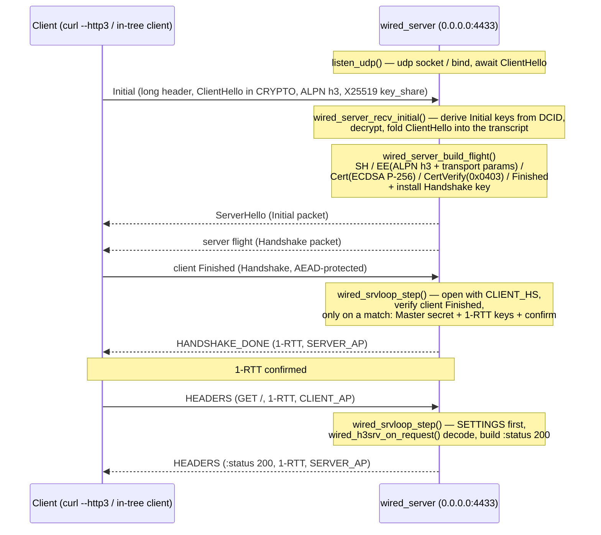

# Real-UDP HTTP/3 server sample

`wired_server.c` is a minimal HTTP/3 server that drives the in-tree server
real-wire loop (`wired_srvloop_step`) from a real client `Initial` over a real
UDP socket through a full handshake to an HTTP/3 `:status 200`, all under real
AEAD protection on the wire. It is libc-free, x86_64-linux only, and runs on
direct syscalls with its own `_start` (a static, freestanding binary).

The whole sample is driven by the single SDK header `#include "wired.h"`. A
client `Initial` is cold-started with one call, `wired_srvboot_accept` (recover
the ClientHello, build and seal the server flight); defining `WIRED_MAIN` before
the include also supplies the libc `memcpy`/`memset` a `-nostdlib` binary needs.

The wire path it owns is the whole exchange: client `Initial` → ServerHello
(Initial packet) + server flight (Handshake packet) → open the client Finished
off the wire, confirm, and seal `HANDSHAKE_DONE` → open a 1-RTT `GET` and seal a
`:status 200` back. Every packet after the Initial is opened with the peer-
direction key and every reply sealed with the server's own-direction key
(RFC 9001 5). The in-tree loopback test runs this same loop over `127.0.0.1`.

## Overview

The server drives one client `Initial` through the whole exchange to an HTTP/3
`:status 200`, every packet after the Initial under real AEAD:

1. Accept the client `Initial`, derive Initial keys from the DCID, decrypt, and
   recover the ClientHello (`wired_server_recv_initial`).
2. Negotiate ALPN `h3`, build the server flight — ServerHello / EncryptedExtensions
   (ALPN `h3` + QUIC transport parameters) / Certificate / CertificateVerify /
   Finished — and install the Handshake key (`wired_server_build_flight`), then
   seal and send the ServerHello (Initial packet) and flight (Handshake packet)
   under the server's own-direction keys (`wired_srvloop_send_initial` /
   `_send_handshake`).
3. Hand every later datagram to `wired_srvloop_step`: it opens the packet with the
   peer-direction key, verifies the client Finished and — only on a match —
   advances to the Master secret, installs 1-RTT keys and confirms, then seals
   `HANDSHAKE_DONE`. A 1-RTT `GET` is decoded (server SETTINGS first) and answered
   with a sealed `:status 200`.

The handshake is gated on a **verified** client Finished: a forged Finished
promotes nothing (the server stays unconfirmed and installs no 1-RTT keys); the
`server_test` phase machine covers that safety check directly.

The end-entity certificate is a runtime self-signed **ECDSA P-256** leaf (the
`0x0403` `ecdsa_secp256r1_sha256` CertificateVerify scheme, RFC 8446 4.4.3),
built by the server driver from its signing scalar; the in-tree client and
loopback test verify it. The ECDHE `key_share` is X25519. P-256 is chosen so the
wire certificate is acceptable to backends that reject Ed25519 server certs (see
the curl section).

## Connection flow



The handshake is gated on a verified client Finished: a forged Finished promotes
nothing (the server stays unconfirmed and never installs 1-RTT keys). SETTINGS is
sent before any response, and a response is built only after a request HEADERS
has been decoded (RFC 9114 6.2.1 / 4.1). The sample drives this whole exchange
over its own socket via `wired_srvloop_step`; the in-tree loopback test runs the
same loop over `127.0.0.1`.

## Build and run

```sh
cd examples/word_list
nix develop          # provides clang / just / tcpdump
just run             # builds and starts on 0.0.0.0:4433
```

`just build` alone produces the `examples/word_list/wired_server` binary (libc-free, own
`_start`). On startup the server prints `listening on 0.0.0.0:4433` and waits for
the ClientHello. Stop it with Ctrl-C.

Pass `--busy-poll` to spin the receive loop with `MSG_DONTWAIT` instead of
blocking on `poll(2)` (`tasks/polling-driver-plan.md`); default is off
(unchanged blocking behavior).

Pass `--pin-core N` to pin the process to CPU N (`sched_setaffinity`) —
mainly useful with `--busy-poll` or the AF_XDP driver, whose spin loop
otherwise migrates across cores and loses cache/NIC-queue locality. Not for
`--workers`/`--cores`, which have their own per-worker pinning.

## Four ways to run it

The default is a plain single-process UDP socket (above). Three more I/O
drivers are opt-in via CLI flags, all driving the exact same application
(message log / static file server). `--workers` is mutually exclusive with
both `--cores` and `--ifindex` (a different SDK entry point); `--cores` and
`--ifindex` combine (AF_XDP multi-queue mode, below) — the process dies at
startup on a conflicting combination.

### Multi-worker (`--workers`, `tasks/core-pinning-plan.md`)

`fork`s N shared-nothing worker *processes* (not threads), each running its
own copy of the unmodified single-process server loop on a socket shared via
`SO_REUSEPORT`, optionally pinned one-per-CPU-core via `sched_setaffinity`.
The parent process is a supervisor that re-forks any worker that dies, in the
same slot (so pinning stays consistent).

| flag | default | meaning |
|---|---|---|
| `--workers N` | — (required to select this driver) | number of worker processes; `0` = auto-detect CPU count |
| `--pin-cores 1` | `0` | pin worker *i* to CPU *i*; `0` = workers float freely across cores |

```sh
just run-workers               # 4 workers, pinned one-per-core
./wired_server --workers 8     # 8 workers, unpinned
```

Each worker binds the same UDP port with `SO_REUSEPORT`; the kernel load-
balances incoming datagrams across the worker sockets by hashing the packet's
4-tuple (source/destination IP and port).

**Known limitation: QUIC connection migration.** RFC 9000 Section 9 allows a
QUIC connection to migrate — the client's IP address or port can change
mid-connection (e.g. a NAT rebind when a mobile client switches networks).
The client's later packets then carry a *different* 4-tuple than the one the
kernel's `SO_REUSEPORT` hash used to route the original handshake to a
worker; the kernel has no notion of "this new 4-tuple belongs to the same
QUIC connection" and can route it to a **different worker**, which will not
recognize the connection. The SDK ships a building block that *could* inform
a smarter router — server-issued connection IDs can carry a worker index in
their leading bits (`quic_ncid_worker_encode`/`quic_ncid_worker_decode`,
`src/transport/packet/frame/frame/ncid_worker.h`) — but making the kernel's
routing itself CID-aware would need `SO_ATTACH_REUSEPORT_EBPF`, and per the
design investigation (`tasks/core-pinning-plan.md`, finding PIN-006): the
simpler `cBPF` variant cannot safely parse QUIC's variable-length CID (no
bounds-checked variable-length reads), and hand-rolled eBPF bytecode (no
`libbpf`/`clang` in this freestanding, libc-free SDK) is judged too costly
for this SDK's scope. This is a documented, out-of-scope gap, not a bug being
silently papered over — see `tests/app/srvworkers_migration_test.c` for a
test that pins down the concrete numbers where the CID's worker-index bits
and a naive 4-tuple-hash-based routing decision disagree.

### Multi-thread (`--cores`, `src/app/http3/server/srvthreads/`)

A DPDK-style control-thread + N-worker-thread fan-out (`clone(2)`/`futex(2)`,
no libc pthreads): one control thread pins itself (optional), blocks
`SIGTERM`/`SIGHUP`, spawns N worker threads sharing the process's address
space (unlike `--workers`' forked processes), then unblocks and installs the
signal handlers on itself alone. Each worker gets its own copy of the server
state (`wired_srvrun_env`) and its own core pin, and runs the same
single-process server loop. `wired_server_broadcast_datagram` (used by
`examples/webtransport_chat`) still reaches every worker's sessions, routed
through a per-worker-pair SPSC ring mesh (`src/app/http3/server/srvinbox/`).

| flag | required | default | meaning |
|---|---|---|---|
| `--cores a,b,c` | yes (to select this driver) | — | comma-separated CPU index per worker thread; worker *i* pins to `cores[i]` |
| `--control-core N` | no | unpinned | CPU to pin the control thread to |

```sh
./wired_server --cores 0,1,2,3                    # 4 worker threads, UDP+SO_REUSEPORT
./wired_server --cores 0,1,2,3 --control-core 4    # + control thread pinned to core 4
```

Combined with `--ifindex`, this becomes AF_XDP **multi-queue** mode: worker
*i* opens NIC queue *i* against one BPF filter shared for the whole
interface (`src/app/http3/server/srvxdpbpf/`) instead of each worker
attaching its own (a second `BPF_LINK_CREATE` on the same interface fails
`-EBUSY`, which is what made single-queue-only true for the plain
`--ifindex` driver below).

```sh
sudo ./wired_server --ifindex $IFIDX --cores 0,1,2,3 --ip 10.7.0.1 --skb-mode --cert cert.pem --key key.pem
```

Set the NIC's queue count to match `--cores`' length first (a mismatch is
not validated — extra worker queues past what the NIC provides simply
receive nothing):

```sh
sudo ethtool -L $IFACE combined 4
```

Same connection-migration caveat as `--workers` above applies here too (a
migrated connection's new 4-tuple can hash to a different worker's RX queue
via RSS and go unrecognized) — the `--workers` section's discussion and
`quic_ncid_worker_encode`/`decode` building blocks apply unchanged.

**Trade-off vs. `--workers`:** threads share one address space, so a crash in
one worker takes the whole process down (no per-worker crash isolation, and
no re-spawn-on-crash supervisor — `--workers`' fork model has both). Use
`--workers` when isolation matters more than the lower cross-worker
communication cost; use `--cores` for AF_XDP multi-queue (which `--workers`
cannot do at all) or when the shared-address-space broadcast path matters.

### AF_XDP (`--ifindex`, `tasks/xdp-driver-plan.md`)

Routes receive/send through an **AF_XDP** socket instead of a plain UDP
socket: packets are polled straight out of a shared UMEM ring (RX/TX/Fill/
Completion), with zero per-packet `recvfrom`/`sendto` syscalls on the receive
side.

Prerequisites: **root** (raw `AF_XDP` socket + BPF program load), **Linux
kernel 5.9 or later** (`BPF_LINK_CREATE` for XDP programs), and a network
interface to bind to — a `veth` pair in its own network namespace is the
easiest way to test without touching a real NIC.

| flag | required | default | meaning |
|---|---|---|---|
| `--ifindex N` | yes | — | network interface index to bind to |
| `--queue N` | no | `0` | RX queue index to bind |
| `--ip a.b.c.d` | yes | — | our IPv4 address (dotted-quad) |
| `--skb-mode` | no | off | attach the XDP program in generic/SKB mode (`XDP_FLAGS_SKB_MODE`) instead of native mode |

`--port`/`--cert`/`--key` are shared with the other two drivers (above).

#### veth + netns verification recipe (root required)

`veth` interfaces often do not support **native** XDP, so this recipe uses
`--skb-mode` (generic XDP) from the start.

```sh
sudo ip netns add wiredcli
sudo ip link add veth0 type veth peer name veth1
sudo ip link set veth1 netns wiredcli
sudo ip addr add 10.7.0.1/24 dev veth0 && sudo ip link set veth0 up
sudo ip netns exec wiredcli sh -c 'ip addr add 10.7.0.2/24 dev veth1; ip link set veth1 up; ip link set lo up'
IFIDX=$(ip -o link show veth0 | cut -d: -f1)
sudo ./wired_server --ifindex $IFIDX --queue 0 --ip 10.7.0.1 --port 4433 --skb-mode --cert cert.pem --key key.pem
# from another terminal:
sudo ip netns exec wiredcli curl --http3-only -kv https://10.7.0.1:4433/
```

Stop the server with Ctrl-C (or `SIGTERM`) once done; it prints the
`XDP_STATISTICS` counters (see below) and exits.

```sh
# cleanup
sudo ip netns del wiredcli
sudo ip link del veth0
```

Confirming the path really goes through XDP:

- `ip link show veth0` should show an attached program: `xdp` (native) or
  `xdpgeneric` (SKB mode) plus a `prog/id`.
- On exit, the server prints six `XDP_STATISTICS` counters: `rx_dropped`,
  `rx_invalid_descs`, `tx_invalid_descs`, `rx_ring_full`,
  `rx_fill_ring_empty_descs`, `tx_ring_empty_descs`. Their presence (a
  successful `getsockopt(XDP_STATISTICS)`) itself confirms the socket was a
  real AF_XDP socket, not a fallback.
- `/proc/net/udp` still shows the UDP socket bound to the port (it stays
  open for port reservation and to absorb non-QUIC frames the BPF filter
  passes through), but its receive queue (`rx_queue` column) should **not**
  grow under load — traffic for the matched port is redirected to the
  AF_XDP socket by the BPF filter before it ever reaches the UDP socket.

#### Known limitations

- The plain `--ifindex` driver (no `--cores`) is only tested against a
  single-queue interface (`veth` has one RX queue by default); a multi-queue
  NIC needs either `ethtool -L <if> combined 1` to pin it down to one queue
  first, or `--cores` (above) to run one worker thread per queue instead.
- MTU > 1500 / multi-buffer (jumbo frame) packets are not supported.
- `veth`'s `CHECKSUM_PARTIAL` offload means the RX path does not verify the
  IPv4/UDP checksum itself; QUIC's own AEAD authentication is the actual
  integrity guarantee, same as the plain-UDP/multi-worker drivers.

## Connecting with `curl --http3`

Run the server on a host where the client can reach UDP `4433`, then:

```sh
curl --http3 --insecure https://<host>:4433/
```

Expected output includes:

```
< HTTP/3 200
```

This was **confirmed on a real external host** (a VPS, not this sandbox): a real
`curl --http3` linked against the **quiche** backend (BoringSSL) completed the
QUIC + TLS 1.3 handshake against this sample and received `HTTP/3 200` for the
`GET`, with the connection closing normally. Scope and caveats, stated honestly:

- **quiche backend confirmed; other backends not.** The completed run used
  curl's quiche/BoringSSL backend. The sample signs with ECDSA P-256 (`0x0403`),
  which BoringSSL accepts where it rejects Ed25519 server certs by default — P-256
  is chosen to clear that hurdle. curl's **ngtcp2** backend (GnuTLS / OpenSSL)
  applies a different MTI / extension set and was **not** exercised, so completion
  there is **not** claimed; it needs separate verification.
- **External host, not this sandbox.** The curl in this sandbox is built
  **without** HTTP/3 (`curl --version` lists no `http3`), so the run was done on a
  separate VPS, not here. Likewise `tcpdump -i lo -n udp port 4433` needs
  `CAP_NET_RAW`, unavailable in the sandbox.
- **One connection, one `GET`.** A single `GET /` answered with `:status 200`;
  no multi-request, no `POST` body, no migration.

## First-choice verification: the in-tree client over loopback

The positive, in-environment check is the repository's own server real-wire loop
(`src/srvloop/`, `src/srvwire/`) driving this exchange over a real UDP loopback
socket (`127.0.0.1`), end to end:

```sh
cd ..
just test
```

The `h3_loopback` test checks, without any external HTTP/3 tooling and without
`CAP_NET_RAW` (it gracefully skips the socket leg when the sandbox forbids
sockets):

1. the client's real protected Initial crosses a loopback UDP socket and arrives
   padded to 1200 bytes (RFC 9000 14.1);
2. a real AEAD-protected client Finished crosses the socket and
   `wired_srvloop_step` opens it with the peer-direction key, confirms the server,
   and seals a `HANDSHAKE_DONE` the peer opens with `SERVER_AP`;
3. a real 1-RTT `GET` crosses the socket and the step seals a `:status 200` the
   peer opens with `SERVER_AP` (RFC 9114 4.1).

The client peer in the test shares the server's key schedule, so seal-then-open
across the wire is identity (RFC 9001 5); the forged-Finished safety check lives
in `server_test`, and the full `src/client/` mutual handshake is exercised in
`client_test`.

## What is verified / what is not

**Verified (demonstrated):**

- **Build**: `cd examples/word_list && just build` produces the `wired_server` binary
  (libc-free, own `_start`).
- **Bind + listen**: `./wired_server` prints `listening on 0.0.0.0:4433` and waits
  for the ClientHello (bind succeeds, no crash).
- **Sample real-wire path**: the sample recovers the ClientHello, seals + sends
  the ServerHello (Initial) and flight (Handshake), then drives
  `wired_srvloop_step` on every later datagram — opening it with the peer key,
  confirming on a verified Finished, and sealing `HANDSHAKE_DONE` and a 200.
- **Loopback datagram delivery**: a real protected Initial crosses a loopback UDP
  socket and arrives padded to 1200 (`h3_loopback`, check 1).
- **Real-wire handshake confirmation**: a real AEAD-protected client Finished
  crosses a loopback socket and `wired_srvloop_step` opens it, confirms, and seals
  `HANDSHAKE_DONE` (`h3_loopback`, check 2; `srvloop_test` for the buffer-path
  equivalent; `server_test` for the full phase machine).
- **Real-wire HTTP/3 GET → 200**: a real 1-RTT `GET` crosses the socket and the
  step seals a `:status 200` the peer opens with `SERVER_AP` (`h3_loopback`,
  check 3).
- **Real `curl --http3` completion**: on a real external host (VPS), a real
  `curl --http3` (quiche / BoringSSL backend) completed the handshake against this
  sample and received `HTTP/3 200` for the `GET`, the connection closing normally.
  This was **not** run in this sandbox (no HTTP/3 curl here) and covers the quiche
  backend only.
- **Forged-Finished safety**: a forged client Finished promotes nothing; the
  server stays unconfirmed and installs no 1-RTT keys (`server_test`,
  `srvloop_test`).
- **Wire format**: the long header conforms to RFC 9000 17.2, the TLS flight to
  RFC 8446 4.4, and the in-tree tests confirm the bytes match the RFC 9001 A.2
  vector.

**Not verified (out of scope or environment-limited):**

- **The full `src/client/` mutual handshake against this sample over the wire**:
  the `h3_loopback` peer shares the server's key schedule rather than running the
  client orchestrator's own certificate verification end to end. The sample's
  real-wire loop (open / confirm / seal) is exercised; pairing it with the full
  `src/client/` handshake over a socket is not.
- Completion against curl's **ngtcp2** backend (GnuTLS / OpenSSL) or other HTTP/3
  clients (Chrome, etc.) — only the **quiche** backend was confirmed; ngtcp2's
  differing MTI / extension set needs separate verification.
- A `tcpdump` packet capture — no `CAP_NET_RAW` in this environment.
- More than one connection or request stream; methods other than `GET`
  (e.g. `POST` with a request body).

## Scope

One connection, one request: a single `GET` answered with `:status 200`. The
ECDHE `key_share` is X25519 and the certificate/CertificateVerify use ECDSA
P-256 (`0x0403`). No Retry, Version Negotiation, 0-RTT, or connection migration.
The
handshake keys and certificate use fixed seeds for reproducibility; a production
server would derive per-run keys.

## Using an external CA-issued certificate chain

Drop `cert.pem` and `key.pem` next to the binary (the server reads them from
the cwd at startup):

```sh
cp /etc/letsencrypt/live/example.com/fullchain.pem cert.pem
cp /etc/letsencrypt/live/example.com/privkey.pem  key.pem
./wired_server
```

Prerequisites:

- Certificate and key are **ECDSA P-256** (RSA and Ed25519 are not supported —
  signing matches the SDK's fixed `quic_p256sign_sign` primitive). The key may
  be a SEC1 `EC PRIVATE KEY` or an unencrypted PKCS#8 `PRIVATE KEY`.
- `cert.pem` is a fullchain, leaf first, at most 2 certificates (leaf + one
  intermediate).
- No files → the server starts with its runtime self-signed certificate as
  before (`self-signed (no cert.pem)`). A broken or half-present pair makes
  the server die at startup instead of silently falling back to self-signed.

A Handshake flight larger than one MTU datagram is split across several
datagrams automatically, so a real chain fits.

The SDK does not check that the key matches the chain's leaf public key —
that agreement is the caller's responsibility. A mismatch is not silently
accepted: the client's CertificateVerify signature check fails and the
handshake does not complete.
